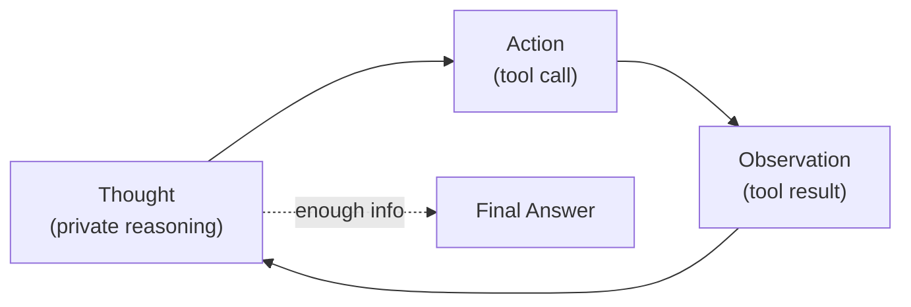

# Agent Architectures — Junior

<!-- level-focus -->
At junior level, focus on this question:

> Given a single well-defined task and one tool, can you trace one full iteration of an agent's loop — observation, reasoning, action, new observation — by hand, and explain what makes that loop an "agent" rather than a single LLM call?

Use the smallest realistic scenario that exposes the decision and its failure behavior.

---

## Core Concept 1 — A Single LLM Call vs. an Agent

A single LLM call is a closed transaction: you send a prompt, you get a completion, nothing you do with that completion changes what the model does next — because there is no "next." Ask a model "what's the status of order #4521?" with no tools and no order data in the prompt, and it can only guess or admit it doesn't know. It cannot go find out.

An **agent** is a program that wraps an LLM in a loop with three properties a single call doesn't have:

1. **It can observe state beyond the prompt** — the result of a tool call, a file's contents, an API response.
2. **The LLM's own output decides what happens next** — including whether to act again or stop.
3. **It repeats** — each action can produce a new observation that feeds the next reasoning step.

The defining property is closed-loop control: nothing about the sequence of steps is hardcoded by the engineer ahead of time in the way a fixed script is. The model decides, at each step, whether it has enough information to answer or needs to act again.

## Core Concept 2 — The ReAct Pattern

The most common shape for this loop is **ReAct** (Reason + Act), introduced by Yao et al. in "ReAct: Synergizing Reasoning and Acting in Language Models" (2022). Each iteration has four parts:



- **Thought** — the model reasons, in text, about what it knows and what it still needs. This is not shown to the end user; it's the model's own scratchpad.
- **Action** — the model emits a structured request to call a specific tool with specific arguments. It does not execute anything itself — your code does that.
- **Observation** — the tool's actual result gets appended back into the conversation as a new message, so the next Thought can see it.
- **Final Answer** — once a Thought concludes no more information is needed, the model produces the user-facing response instead of another Action.

## Core Concept 3 — Tracing One Iteration By Hand

Take a support-ticket agent with one tool: `get_order_status(order_id: string) -> {status, eta}`. A customer sends: "What's the status of order #4521?"

**Turn 1 — system + user message sent to the model:**

```
System: You are a support agent. You have one tool: get_order_status(order_id).
User: What's the status of order #4521?
```

**Model's response (Thought + Action):**

```
Thought: The user is asking about a specific order. I don't have its
status yet. I should call get_order_status.
Action: get_order_status(order_id="4521")
```

At this point the model has *not* answered the user. Your agent code parses the Action, actually calls the function, and gets back a real result — say the order system returns:

```json
{"status": "shipped", "eta": "2026-09-05"}
```

**Turn 2 — the observation is appended and sent back to the model:**

```
System: You are a support agent. You have one tool: get_order_status(order_id).
User: What's the status of order #4521?
Assistant: Thought: ... Action: get_order_status(order_id="4521")
Tool result: {"status": "shipped", "eta": "2026-09-05"}
```

**Model's response (Thought + Final Answer):**

```
Thought: I now have the order's status and ETA. I can answer directly.
Final Answer: Order #4521 has shipped and is expected to arrive by
September 5, 2026.
```

That's one full loop iteration: one Thought/Action pair, one Observation, followed by a Thought that decides no further action is needed. Two model calls happened in total (Turn 1 and Turn 2) — a single LLM call could never have produced the second Thought, because it never saw the tool result.

## Core Concept 4 — Basic Stopping Conditions

At this level, two stopping conditions matter:

- **Success** — a Thought concludes it has enough information and emits a Final Answer instead of another Action. This is the normal, intended exit.
- **A hard iteration cap** — even a simple agent needs an upper bound on how many Thought/Action cycles it can run before the surrounding code forces a stop (e.g., "if no Final Answer after 6 iterations, stop and return an error"). Without this, a model that never concludes it has enough information will keep acting indefinitely. Deeper safeguards against runaway loops are covered at senior level — at junior level, just know the cap exists and why: an LLM's Thought is a probabilistic judgment, not a guarantee, and it can be wrong about whether it's done.

## Common Mistakes

1. **Calling a single prompt with a tool description "agentic."** If the model only ever gets one turn — it names a tool it *would* call but your code never executes it and feeds the result back — there is no loop, no observation, and no agent. It's a single call that happens to mention a tool.
2. **Forgetting to feed the tool result back into context.** If Turn 2 doesn't include the `Tool result` message, the model has no way to know the call succeeded, what it returned, or that it happened at all — its next Thought will be reasoning over nothing.
3. **Confusing Thought with Final Answer.** The Thought is the model's private reasoning trace; showing it directly to the end user (rather than the Final Answer) leaks internal reasoning — including any wrong turns — as if it were the actual response.
4. **Assuming the loop terminates on its own.** A model that keeps concluding "I need more information" (even when it doesn't) will keep acting forever without an iteration cap. The cap is not optional scaffolding — it is part of what makes the loop an engineered system rather than an open-ended hope.

## Apply It

1. Pick a simple, well-defined question that requires exactly one piece of external information to answer (an order status, a weather lookup, a stock price).
2. Define one tool's signature: name, one input parameter, and the shape of its return value.
3. Write out, as plain text, the two full turns from Core Concept 3: the first Thought/Action, the Tool result, and the second Thought/Final Answer.
4. Identify the single piece of information in the Tool result that the Final Answer depends on, and confirm the Final Answer couldn't have been produced without it.

## Verify Your Work

- Your transcript shows a Thought that explicitly names what information is missing before the first Action.
- The Action's arguments match the tool's defined signature exactly (right parameter name, right type).
- The Tool result appears as its own message before the second Thought, not folded into the model's own text.
- The Final Answer only appears after the Tool result has been observed — never before.
- You can state, in one sentence, why a single LLM call (no loop) could not have produced this same Final Answer.

## Review Questions

- What are the three properties that turn a single LLM call into an agent loop?
- In the ReAct pattern, what is the difference between a Thought and a Final Answer, and why does the end user only see one of them?
- Why does the model never execute a tool itself — who actually runs the Action, and why does that division matter?
- What would happen to a ReAct loop if the tool result were never appended back into the conversation?
- Why is a hard iteration cap necessary even for a simple, well-behaved agent?
