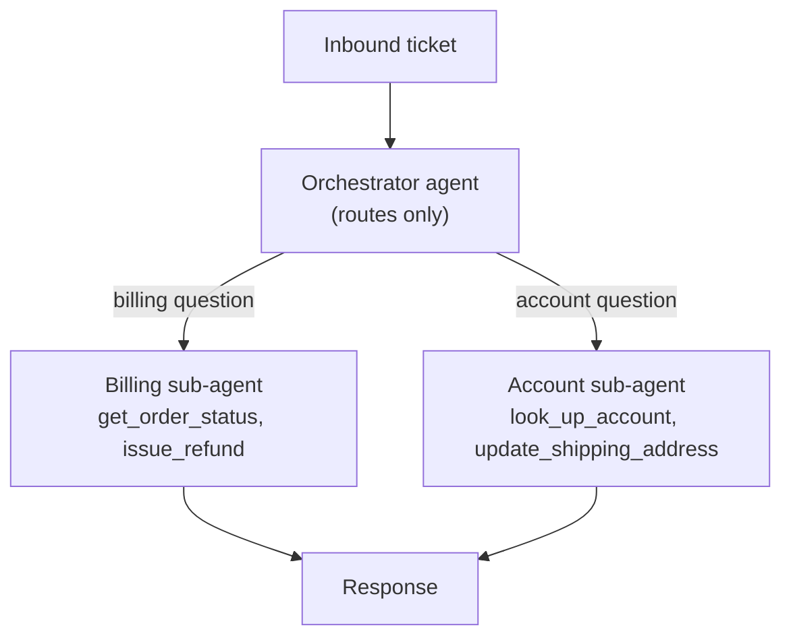

# Agent Architectures — Middle

<!-- level-focus -->
At middle level, focus on this question:

> When a single agent's scope grows — more tools, more distinct domains of work — how do you decide whether to keep it as one agent or split it into an orchestrator with specialized sub-agents, and justify that choice against complexity, cost, and reliability rather than preference?

Use the smallest realistic scenario that exposes the decision and its failure behavior.

---

## Core Concept 1 — What Breaks Down as a Single Agent Grows

The junior-level support agent has one tool: `get_order_status`. A realistic support agent needs more: `get_order_status`, `issue_refund`, `update_shipping_address`, `look_up_account`, `escalate_to_human`, `search_faq`. Every one of those tool definitions — name, description, parameter schema — sits in the same system prompt, and every Thought the model produces has to select correctly among all of them.

This degrades in three concrete ways as tool count and domain breadth grow:

- **Tool-selection confusion.** Two tools with overlapping-sounding purposes (`update_shipping_address` vs a hypothetical `update_account_address`) increase the rate at which the model picks the wrong one, especially as descriptions get terser to save context budget.
- **Context bloat.** Every tool's schema and description is sent on every single call, whether or not that turn needs it — a billing question still pays the token cost of the shipping-address tool's full schema sitting in context.
- **Harder debugging.** When something goes wrong, "which of twelve tools, in which domain, misfired" is a much larger search space than "which of three tools misfired."

None of this is fatal at small scale. The middle-level judgment call is recognizing *when* it stops being fine.

## Core Concept 2 — The Orchestrator / Sub-Agent Pattern

The common fix is to split by domain: a **planner or orchestrator** agent receives the user's message, decides which domain it belongs to, and delegates to a **sub-agent** scoped to that domain's tools and system prompt alone.

The orchestrator's own job is deliberately narrow: classify and route, not solve. Each sub-agent runs its own ReAct loop with a small, coherent tool set and a system prompt written for exactly one domain — which is precisely the junior-level shape, just instantiated twice with narrower scope each time.

## Core Concept 3 — The Cost This Actually Has

Multi-agent is not free, and the cost is countable, not vague:

- **An extra LLM call per request** for the routing decision itself, before any actual work starts.
- **A summarization/handoff cost** if the sub-agent's result needs to be translated back into a final user-facing response by the orchestrator (another call), rather than the sub-agent answering directly.
- **A new failure mode: misrouting.** If routing accuracy is 92%, roughly 1 in 12 tickets goes to the wrong sub-agent, which then either fails outright (no tool in scope can answer) or, worse, answers something adjacent to what was actually asked. Each misroute costs the latency and token spend of a wasted sub-agent invocation *plus* whatever it costs to detect and re-route.

Run the arithmetic before deciding: a single-agent support bot handling ~3 tool calls per ticket costs roughly 4 LLM calls end to end. An orchestrator + one sub-agent adds the routing call and a handoff summarization, for roughly 6 calls per ticket on the 92% correctly-routed path, and more on the misrouted 8%. That's a real cost increase that has to be justified by a real reliability or maintainability gain — not assumed away because the architecture "sounds" more scalable.

## Core Concept 4 — A Decision Rule, Not a Preference

| Signal | Favors single-agent | Favors multi-agent (orchestrator + sub-agents) |
|---|---|---|
| Tool count | Roughly under 10, one coherent domain | Tools split into genuinely non-overlapping domains (billing vs. account vs. technical) |
| Task structure | Doesn't naturally decompose — most tickets need tools from across the whole set | Naturally decomposes — a given ticket almost always belongs to exactly one domain |
| Debuggability need | A single trace is enough to diagnose most failures | You need to isolate failures to one domain's tools without wading through unrelated ones |
| Cost tolerance | Routing/handoff overhead isn't justified by the volume or stakes | The routing overhead is small relative to the cost of a misapplied tool from the wrong domain |
| Team ownership | One team owns the whole tool set | Different teams own different domains and want to iterate independently |

Apply it as a rule, not a vibe: if you cannot point to a specific tool-selection confusion or a specific team-ownership boundary that a split would fix, the split is speculative complexity, not a justified design.

## Core Concept 5 — Cross-Component Scenario: Expanding the Support Agent

The single-agent support bot (order status only) is asked to also handle refunds and shipping-address changes. Apply the rule from Core Concept 4:

1. **Tool count** goes from 1 to 6 — past the rough single-agent comfort zone.
2. **Task structure** does decompose cleanly: a ticket about "where's my order" never needs the refund tool, and a ticket about "change my address" never needs order-status lookup in the same turn.
3. **Team ownership**: refunds are owned by the billing team (who also care about fraud controls on `issue_refund`); shipping/account changes are owned by a separate account-management team.

All three signals point the same direction, so the decision is: split into an orchestrator plus a billing sub-agent and an account sub-agent, each keeping its own narrow tool set. If only the tool-count signal had fired, with task structure staying entangled (most tickets genuinely need both billing and account tools together), the right call would have stayed single-agent, because splitting would just relocate the entanglement into a chatty back-and-forth between two sub-agents instead of removing it.

## Core Concept 6 — Verification at Two Levels

**Unit level — each sub-agent in isolation:** feed the billing sub-agent a representative set of billing-only tickets directly (bypassing the orchestrator entirely) and confirm it resolves them correctly using only its own tools. This isolates "does the sub-agent work" from "does routing work."

**Integrated-flow level — through the orchestrator:** feed the full system a mixed batch of tickets spanning both domains and measure routing accuracy directly (did each ticket land on the sub-agent whose domain it actually belongs to?), not just whether the final answer looked reasonable. A ticket that got misrouted but the wrong sub-agent still produced a plausible-sounding (wrong) answer is a passing "looks fine" and a failing routing check — measure routing explicitly, don't infer it from output quality.

## Common Mistakes

- **Splitting into multi-agent because it "feels" more sophisticated.** Without a specific tool-selection or ownership problem it solves, the split adds routing cost and a new failure mode for no measured benefit.
- **No clear ownership boundary between sub-agents' tool sets.** If both the billing and account sub-agents can call `issue_refund`, you get duplicate or racing refund attempts with no single owner accountable for that tool's behavior.
- **No fallback for misrouting.** Treating the orchestrator's routing decision as ground truth, with no path for a sub-agent to say "this isn't my domain, re-route," turns every misroute into a dead end instead of a recoverable retry.
- **Measuring "it works" by output plausibility instead of routing accuracy.** A wrong-but-fluent answer from the wrong sub-agent passes an eyeball check and fails the actual requirement.

---

## Apply It

1. Take (or design) a single-agent system with at least 5 tools spanning at least two distinct domains.
2. Run the decision rule from Core Concept 4 against it explicitly — tool count, task structure, debuggability, cost tolerance, team ownership — and write down which signals favor a split and which don't.
3. If the signals favor a split, design the orchestrator's routing prompt and the two sub-agents' narrowed tool sets; if they don't, write the one sentence justifying why the added routing cost isn't worth it yet.
4. Compute the call-count cost difference (Core Concept 3's arithmetic) between the single-agent and multi-agent version for your actual expected ticket volume.
5. Design one test batch of at least 10 realistic requests spanning both domains, and define what "correct routing" means for each one before running anything.

## Verify Your Work

- You can name the specific tool-selection confusion or ownership boundary that motivated (or ruled out) the split — not a general feeling that multi-agent is "more robust."
- The call-count cost difference is a real number for your expected volume, not an assumption that "a few extra calls don't matter."
- Each sub-agent, tested in isolation, resolves its own domain's requests correctly using only its own tools.
- Routing accuracy is measured directly against your labeled test batch, not inferred from whether the final answers sounded plausible.
- You can state what happens on a misroute — a defined fallback, not silent wrong-domain handling.

## Review Questions

- What three concrete problems does a single agent's scope growing actually cause, beyond a vague sense of "it's getting complicated"?
- What is the real cost — in LLM calls — that an orchestrator/sub-agent split adds over a single agent, for a given ticket?
- Under what condition does the decision rule favor staying single-agent even when tool count is high?
- Why is measuring routing accuracy directly, rather than judging final-answer plausibility, necessary to verify a multi-agent split actually works?
- What failure results from two sub-agents both having access to the same high-stakes tool with no ownership boundary?
