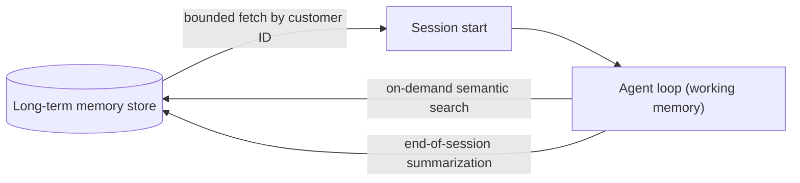

# Agent Architectures — Senior

<!-- level-focus -->
At senior level, focus on this question:

> For an agent that spans multiple sessions over weeks or months, what specifically persists as long-term memory, what stays ephemeral within a single run, how is persisted memory retrieved back into context — and what safeguards stop the loop itself from running away before any of that memory matters?

Use the smallest realistic scenario that exposes the decision and its failure behavior.

---

## Core Concept 1 — Two Kinds of Memory, Not One

"Agent memory" collapses two genuinely different things that need different designs:

| | Short-term / working memory | Long-term memory |
|---|---|---|
| **What it holds** | The current conversation, the model's own Thought/Action/Observation trace, an in-progress scratchpad | Durable facts, summaries, and outcomes that outlive a single run |
| **Where it lives** | Entirely inside the context window of the current run | An external store (vector database, key-value store, structured database) outside the model's context |
| **Lifetime** | Discarded when the session ends | Persists across sessions — days, weeks, months |
| **How it's used** | Read and appended to directly as part of the loop | Retrieved on demand and injected into context as new input |

Conflating the two produces two opposite failures: treating everything as short-term (the agent has amnesia between sessions — a returning customer has to re-explain their whole history every time) or treating everything as long-term (every raw scratchpad and tool call gets persisted forever, and retrieval either drowns in irrelevant detail or costs more to search than the value it returns).

## Core Concept 2 — Deciding What Persists

For the support agent handling a returning customer across sessions, decide persistence by asking: *will a future session need this specific fact, or just the conclusion it led to?*

| Persist (long-term) | Discard after session (ephemeral) |
|---|---|
| Customer identity and account reference | The specific sequence of Thought/Action/Observation steps taken this session |
| A compact summary of each resolved ticket ("shipping delay on order #4521, resolved with a $10 credit, customer accepted") | Raw tool outputs in full (a full order-history API response) — only the distilled conclusion is kept |
| Stated preferences ("prefers email over chat", "has disputed a charge before") | Intermediate failed attempts and dead-end reasoning from this session |
| Outcomes with future relevance (an open dispute, a standing refund policy exception granted) | Anything reconstructable on demand from a system of record (the order database itself is not memory — it's a tool call away) |

The rule of thumb: long-term memory holds *conclusions*, not *traces*. A full transcript is expensive to store, expensive to retrieve relevantly, and mostly irrelevant three weeks later — a two-sentence summary captures what the next session actually needs.

## Core Concept 3 — How Memory Gets Back Into Context

Persisting memory is only half the design; retrieval is the half that determines whether it's actually useful:

- **At session start**, fetch a bounded set of directly relevant facts — typically a structured lookup by customer ID (not a broad semantic search) for "who is this and what's their recent history" — and inject it as a compact context block before the first user message. Bounded matters: injecting every past ticket summary ever recorded for a long-time customer reintroduces the context-bloat problem from the middle-level tool-count discussion, just with memory records instead of tool schemas.
- **During the session, on demand**, retrieve more only if the current Thought identifies a need for it — e.g., a semantic search over past ticket summaries when the customer references "that thing we discussed before" without specifics. This keeps the default context lean and only pays the retrieval cost when it's actually needed.
- **On the write side**, memory is produced by a distillation step — typically a summarization call at session end, not a running log of every message — so what gets persisted is already in the "conclusion, not trace" shape from Core Concept 2 before it's written anywhere.

## Core Concept 4 — Loop-Termination Safeguards

A well-designed memory strategy does nothing to stop a loop from running away within a single session. That's a separate, mandatory design surface:

| Failure mode | Symptom | Safeguard |
|---|---|---|
| **Infinite tool-call loop** | The agent repeatedly calls the same tool with the same or near-identical arguments because it never recognizes the task is stuck | A repeated-identical-call detector (same tool + same arguments N times in a row) that forces an escalation instead of another attempt, on top of a hard iteration cap |
| **Runaway tool calls / cost blowout** | The agent calls an expensive tool (an LLM-backed search, a paid third-party API) many times in one session | A per-session tool-call budget and a cost ceiling, enforced by the surrounding code, not by asking the model to self-limit |
| **Context exhaustion mid-task** | Accumulated tool outputs fill the context window; the agent loses earlier reasoning, or the run errors outright | Summarize or compact older turns instead of keeping full history verbatim; cap the size of any single tool output before it's injected (truncate or paginate large results) |
| **Goal drift** | After many iterations, the agent's actions have drifted from what the user actually asked for | Periodically re-inject the original goal verbatim into context; add an explicit self-check step ("does this next action still serve the original request?") before acting |

None of these are optional polish — each maps to a failure that is trivial to reproduce and easy to miss until it happens in production, because a well-behaved test run never exercises them.

## Core Concept 5 — Cross-Component Scenario: The Returning Customer and the Stuck Loop

A customer opens a ticket about a shipping delay on order #4521. The session resolves it with a $10 credit; at session end, the distillation step writes: *"Shipping delay on order #4521, resolved with $10 credit, customer accepted, 2026-08-14."* Three weeks later, the same customer messages again about a *different* order, #6810.

At session start, the bounded customer-ID lookup retrieves the prior summary and injects it — the agent now knows this customer has a recent resolved shipping complaint, without needing the full transcript. That's the memory design working as intended.

Now the customer's message has a typo: `#6180` instead of `#6810`. `get_order_status("6180")` returns not-found. The model's Thought reasons it might have misread the ID and retries `get_order_status("6180")` again — same tool, same argument, same result — and does this six times in a row.

Two hypotheses for why, and what would distinguish them:

| Hypothesis | Evidence that confirms it | Evidence that rules it out |
|---|---|---|
| **No repeated-identical-call detector; the model just keeps re-trying the same failed call, hoping for a different result** | The trace shows six calls with byte-identical arguments and no change in reasoning between attempts | The trace shows the model trying variations (different digit orderings, asking the customer to confirm) before any repeat |
| **The tool itself is flaky and genuinely returning different transient errors each time, not a logic loop** | The six calls have different error messages or intermittent successes mixed in | All six calls return the identical not-found response |

In the actual case, all six calls returned the identical not-found response with no variation in the model's arguments or reasoning — confirming the first hypothesis, not a flaky tool. The fix is the repeated-identical-call detector from Core Concept 4: after two identical failed attempts, force an escalation ("I'm having trouble finding that order — could you double check the number, or would you like me to connect you with a person?") instead of a third identical retry.

## Core Concept 6 — Questions That Expose Weak Assumptions

- "If this agent runs for 50 iterations without a Final Answer, what actually stops it — and has anyone watched that safeguard fire, or is it just assumed to be there?"
- "What's actually being persisted to long-term memory right now — conclusions, or raw transcripts? If it's raw transcripts, what happens to retrieval quality after a thousand sessions?"
- "Does memory retrieval at session start scale with how long this customer has been active, or is it bounded regardless of history length?"
- "If the same tool call fails twice in a row, does the agent do something different on the third attempt, or literally repeat itself?"
- "Has anyone deliberately fed this agent a task that never resolves, just to watch which safeguard catches it first?"

---

## Real-World Examples

- **A bounded memory fetch prevents a slow, expensive session start.** An agent for a customer with years of ticket history retrieves every past summary unconditionally at session start; latency and token cost both grow with account age. Bounding the fetch to the most recent N summaries, with on-demand semantic search available for anything older, keeps session start cost flat regardless of account tenure.
- **A repeated-identical-call detector turns a stuck loop into a graceful escalation.** As in Core Concept 5, an agent retrying an identical failed tool call six times in a row is caught by comparing consecutive calls' arguments, not by any change in the model's own stated reasoning — the model's Thought text kept sounding confident each time, which is exactly why an external, code-level detector is necessary rather than trusting the model to notice on its own.

## Common Mistakes

- **Persisting full transcripts as "memory."** Produces a store that's expensive to search and mostly irrelevant, defeating the point of having memory at all.
- **Unbounded memory retrieval at session start.** Session cost and latency grow with account history length instead of staying flat.
- **Trusting the model's own Thought to notice it's stuck.** A model can sound confident on the fourth identical failed retry exactly as it did on the first — the safeguard has to live in the surrounding code, not in the prompt.
- **No context-compaction strategy for long sessions.** Tool outputs accumulate until the context window is exhausted, and earlier reasoning is silently lost rather than deliberately summarized.
- **Treating memory design and loop-safeguard design as the same problem.** They are separate concerns — a perfect memory strategy does nothing to stop a within-session infinite loop, and a perfect iteration cap does nothing to give the agent continuity across sessions.

---

## Apply It

1. For a multi-session agent you have or are designing, write the persist/discard table from Core Concept 2 concretely for your actual data — name specific fields, not categories.
2. Design the retrieval mechanism for session start: what's the lookup key, what's the bound (count, recency, or both), and what triggers an on-demand deeper retrieval mid-session.
3. Implement or specify a repeated-identical-call detector and a hard iteration cap, and state the exact threshold for each with a one-sentence justification.
4. Deliberately construct a task that cannot resolve (an order ID that will never exist) and run it through the agent to confirm which safeguard fires, and that it fires before context is exhausted.
5. Using the evidence-table format from Core Concept 5, write two competing hypotheses for one failure you've actually seen (or can construct) and state what evidence would distinguish them.

## Verify Your Work

- Your persist/discard table names specific fields and explicitly excludes raw tool-call traces from long-term storage.
- Session-start retrieval latency stays roughly flat regardless of how much history a given customer has accumulated.
- The repeated-identical-call detector actually fires in a deliberate stuck-loop test, and does so before the hard iteration cap would have caught it anyway.
- You have a real trace (not a hypothetical) showing a safeguard triggering, with the specific evidence that told you which failure mode occurred.
- You can state, for your design, what happens to an in-progress session if the process crashes mid-loop — is working memory lost entirely, or is there a checkpoint?

## Review Questions

- What distinguishes long-term memory from short-term/working memory, and why does conflating them fail in two opposite directions?
- Why should long-term memory store conclusions rather than raw traces, even though raw traces are more complete?
- What's the difference between a bounded session-start memory fetch and an on-demand mid-session retrieval, and why does a design need both?
- Name the four loop-termination failure modes from Core Concept 4 and the safeguard for each.
- In the returning-customer scenario, what specific evidence distinguished "the model is stuck repeating itself" from "the tool is genuinely flaky"?
