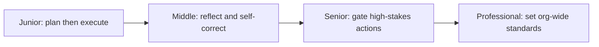
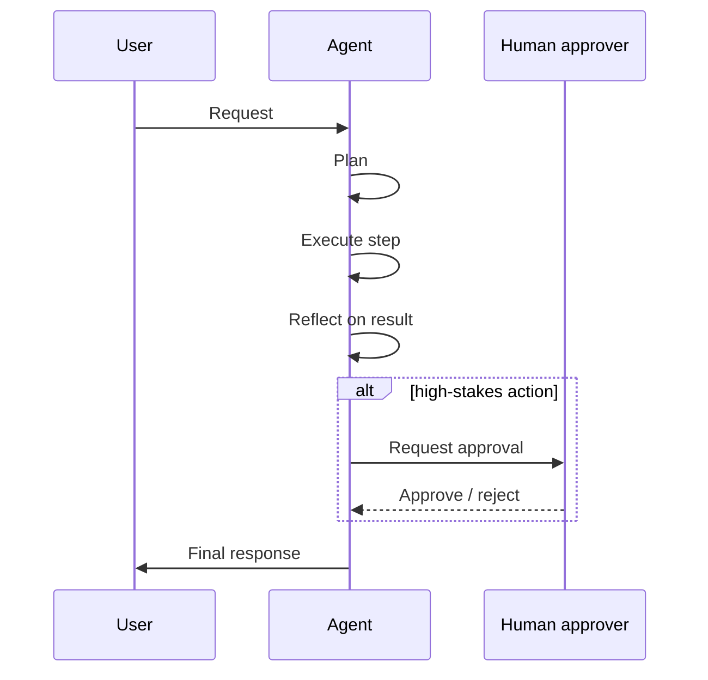

# Agentic Techniques

> The loop from Agent Architectures is the engine. These are the driving habits layered on top of it — plan before acting, check your own work, and stop to ask before doing something you can't undo.

## Levels

| Level | Guide | You are done when |
|---|---|---|
| Junior | [Implement plan-then-execute](junior.md) | You can write an upfront plan for a well-defined task and execute it step by step. |
| Middle | [Add reflection and self-correction](middle.md) | You can add a checkable reflection step and measure whether it actually improves reliability. |
| Senior | [Design human-in-the-loop gates](senior.md) | You can design an approval gate for a high-stakes action that balances autonomy against risk. |
| Professional | [Set org-wide technique standards](professional.md) | You can define which techniques are mandatory for which risk tier, and how autonomy is reviewed. |

## Practice rule

Never add a technique — planning, reflection, a human gate — without naming the specific failure it's meant to catch, and how you'll know if it caught it. A technique that isn't measured is a guess dressed up as a feature.

## Related

- [Agent Architectures](../agent-architectures/) — the loop these techniques are layered on top of.
- [Tools and MCP](../tools-and-mcp/) — the actions these techniques plan, reflect on, and gate.
- [Prompt Engineering](../../llm-fundamentals/prompt-engineering/) — how the planning and reflection prompts themselves are written.
- [AI Evaluation](../../ai-evaluation/) — measuring whether a technique actually improved reliability, not just adding latency.
