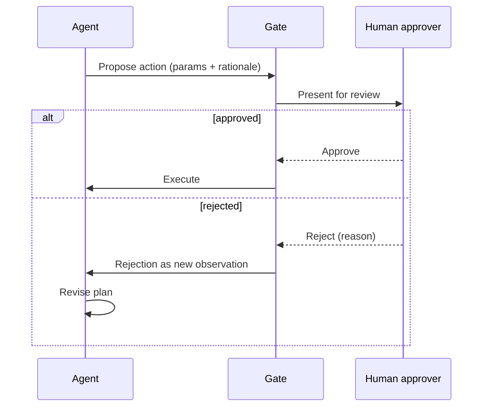

# Agentic Techniques — Senior

<!-- level-focus -->
At senior level, focus on this question:

> For a high-stakes agent action — issuing a refund, sending an external email, modifying production data — how do you design a human-in-the-loop approval gate that actually reduces risk without turning every action into a bottleneck that defeats the point of automation?

Use the smallest realistic scenario that exposes the decision and its failure behavior.

---

## Core Concept 1 — Risk Tiers, Not a Single Gate-or-No-Gate Decision

Not every action an agent takes carries the same risk, and treating them uniformly — gate everything, or gate nothing — is wrong in both directions. A useful starting split:

| Tier | Example | Gate needed? |
|---|---|---|
| **Read-only / fully reversible** | Looking up an order status, searching a knowledge base | No gate — nothing changes state |
| **Write, low value, easily reversible** | Updating a customer's stated contact preference | No pre-action gate; post-hoc audit log is enough |
| **Write, hard to reverse or meaningful value** | Issuing a refund, changing a shipping address on an order already in transit | Pre-action approval gate required |
| **Destructive or irreversible, high value or high blast radius** | A refund above a large threshold, modifying production data directly, sending a legally binding communication | Mandatory approval, possibly with a second approver (dual control) |

The tier a specific action belongs in is a judgment call about reversibility, financial or legal exposure, and blast radius — not about how "risky-sounding" the action's name is. A refund of $8 and a refund of $8,000 are the same tool call with wildly different risk profiles, which is exactly why gate design in Core Concept 3 keys off the parameters of the call, not just which tool was called.

## Core Concept 2 — What an Approval Gate Actually Does

A gate is not "ask a human to approve the ticket." It's a specific mechanical interruption in the agent's loop:

1. **The agent proposes, it doesn't execute.** The Action is emitted with its full structured parameters and the model's stated rationale, but the tool call is intercepted before it actually runs.
2. **A human reviews the proposal**, not a summary of the whole conversation — specifically the parameters ("refund $340 to order #4521, reason: shipping delay, policy exception: none") and the rationale, so the reviewer can approve or reject in seconds without re-deriving the whole ticket history.
3. **On approval, the gate executes the tool call** — the human isn't the one calling the API; they're authorizing the agent to.
4. **On rejection, the reason feeds back into the loop as a new observation**, exactly like a failed tool call, so the agent can revise — propose a smaller refund, ask the customer a clarifying question, or escalate further — rather than the interaction simply dead-ending.

## Core Concept 3 — Balancing Autonomy Against Risk

| Factor | Pushes toward stricter gating | Pushes toward looser gating |
|---|---|---|
| Reversibility | Hard or impossible to undo | Easily reversed with no lasting cost |
| Financial/legal exposure | High dollar value, contractual, or regulatory implications | Trivial value, no external commitment |
| Blast radius | Affects data or people beyond the immediate interaction | Scoped to a single, contained record |
| Model's own confidence signal | Low — the rationale is thin, hedged, or the situation is genuinely ambiguous | High — the rationale is specific, cites clear policy, and the case is unambiguous |

The two costs of getting this wrong run in opposite directions. **Over-gating**: every refund, regardless of size, requires human approval — the human becomes a bottleneck processing hundreds of trivial $5 approvals a day, which both slows the system down and, worse, trains the approver to rubber-stamp without reading (see Common Mistakes). **Under-gating**: a large or ambiguous refund executes autonomously and turns out to be wrong, at a cost that dwarfs whatever latency the gate would have added. There is no universal correct threshold — it's set by the actual cost of a wrong action in a specific tier versus the actual cost of approver time, and it should be a deliberate, written decision, not a default.

## Core Concept 4 — Autonomy Is Earned With Evidence, Not Granted by Default

Start every new high-stakes action fully gated — 100% of proposals go to a human — and use the resulting approval/rejection data to decide whether to loosen it, not intuition:

1. Log every gated proposal's parameters, the human's decision, and (if rejected) the reason.
2. After enough volume to be statistically meaningful, look for a pattern: are refunds under a certain dollar amount, with a specific policy citation in the rationale, approved essentially 100% of the time with zero rejections?
3. If so, raise the auto-approve threshold for exactly that narrow, evidenced case — e.g., "refunds under $25 citing the standard shipping-delay policy auto-approve; everything else still gates" — and keep logging, because the threshold is a hypothesis being continuously tested, not a permanent grant.
4. Anything outside the evidenced pattern — a new reason code, a higher amount, a case the model's rationale hedges on — stays gated by default. Widening autonomy is additive and evidence-based, never a blanket loosening.

This is the same posture as a canary rollout in a deployment: start conservative, expand only where the data supports it, and keep the ability to tighten back down.

## Core Concept 5 — Cross-Component Scenario: Designing the Refund Gate

The support agent from the [architecture](../agent-architectures/) subtopic now has an `issue_refund(order_id, amount, reason)` tool. Design the gate:

1. **Tier the action by amount and reason**, not uniformly: refunds under $25 with a reason matching a pre-approved policy list (shipping delay, minor defect) are Tier 2 (post-hoc audit only, once evidence from Core Concept 4 supports it); anything above $25, or any reason outside the pre-approved list, is Tier 3 (pre-action gate).
2. **Design the gate's timeout.** An approver who's away can't be allowed to block the interaction indefinitely — set an explicit timeout (e.g., 30 minutes) with a defined fallback: escalate to a secondary approver, or auto-deny with a notification and a message to the customer that a person will follow up.
3. **Design what the customer sees while gated.** The agent shouldn't leave the customer with silence — a holding message ("I'm processing this and will confirm shortly") set expectations honestly instead of implying the refund already happened.
4. **Design the rejection path.** If a human rejects the proposed $340 refund with the reason "amount too high for this issue type, offer $50 credit instead," that reason becomes the agent's next observation, and its next proposal should reflect it — not repeat the same rejected amount.

## Common Mistakes

- **No timeout on the gate.** An agent waiting indefinitely for a human who's unavailable turns automation into a worse experience than no automation at all — the customer waits longer than if a human had just handled the whole ticket.
- **Gate fatigue from over-gating.** Sending every trivial, low-risk action through the same approval queue as genuinely high-stakes ones causes reviewers to stop reading carefully and start rubber-stamping — which quietly turns a designed safety control into a false sense of one.
- **Granting autonomy from a hunch instead of logged evidence.** Raising an auto-approve threshold because "it seems fine" rather than because a specific, narrow pattern has zero rejections over meaningful volume reintroduces exactly the risk the gate existed to prevent.
- **Gating by tool name instead of by parameters.** Treating every call to `issue_refund` identically regardless of amount ignores that the risk profile of the same tool varies enormously with its arguments.
- **Silent rejection with no reason fed back.** A rejection that doesn't tell the agent *why* leaves it unable to propose anything better on the next attempt, and it will likely just resubmit something close to the same rejected proposal.

---

## Real-World Examples

- **A narrow auto-approve threshold reduces approver load without reducing safety.** After several weeks of 100%-gated refunds, the data shows refunds under $25 citing the shipping-delay policy have a zero-rejection rate across hundreds of cases; auto-approving exactly that narrow band cuts approval-queue volume substantially while every other case — different reason, higher amount — still gates as before.
- **A missing timeout turns a gate into a worse experience than no automation.** An approval queue backs up during a public holiday when reviewers are unavailable; customers who would have been told "approved" or "denied" within minutes by a human agent instead wait hours for an agent stuck at a gate with no timeout defined. Adding a timeout with an auto-escalation path fixes the specific gap.
- **Gate fatigue produces a rubber-stamped approval that shouldn't have passed.** A reviewer processing dozens of near-identical low-stakes approvals per shift starts approving without reading closely; a genuinely unusual, higher-value request slips through in the same rhythm. The fix is routing high-stakes items to a visually distinct queue, separate from the routine low-stakes ones, so reviewer attention isn't diluted by volume.

---

## Apply It

1. Take a real or plausible high-stakes action your agent (or one you're designing) could take, and tier it explicitly by reversibility, financial/legal exposure, and blast radius.
2. Design the gate mechanics: what the human sees, what "approve" and "reject" each trigger in the agent's next step, and the explicit timeout and its fallback.
3. Define what evidence (volume and rejection rate) would justify narrowing the gate to an auto-approve threshold for a specific, narrow case — write the actual numbers you'd require, not a vague "once it's proven safe."
4. Write the message the end user sees while the action is gated, and confirm it doesn't imply the action has already completed.
5. Walk through a rejection: write the human's rejection reason, and write the agent's next proposal, confirming it actually incorporates the reason rather than repeating the same request.

## Verify Your Work

- The tiering is based on reversibility, exposure, and blast radius for this specific action — not copied wholesale from a different action's risk profile.
- The gate has an explicit, stated timeout and a defined fallback, not an implicit assumption that a human is always available.
- The auto-approve threshold, if any, is backed by a specific volume and rejection-rate number you'd require before granting it — not intuition.
- The customer-facing message during the gate is honest about the action's status.
- The rejection-to-revised-proposal path actually changes the next proposal in response to the stated reason.

## Review Questions

- Why does the same tool call (e.g., `issue_refund`) need different gating depending on its parameters, not just its name?
- What specifically differentiates over-gating from under-gating, and what does each cost?
- Why should autonomy be widened only based on logged approval/rejection evidence, rather than a general sense that a pattern "seems safe"?
- What happens to a customer's experience when a gate has no timeout, and what's the fix?
- Why does gate fatigue from over-gating low-stakes actions actually reduce safety on high-stakes ones?
