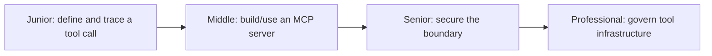
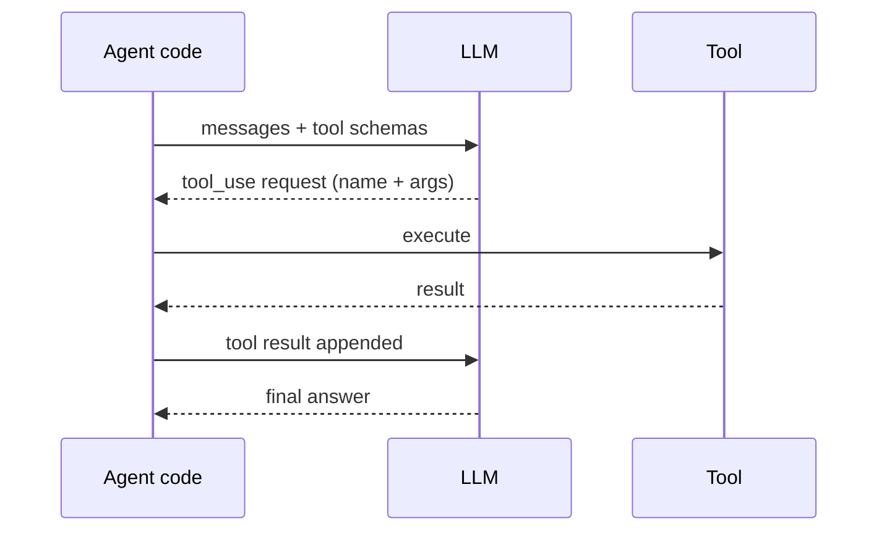

# Tools and MCP

> A tool call is the point where an agent's reasoning stops being talk and starts touching the real world — a schema the model chooses from, a round trip your code executes, and a boundary that has to hold even if the model or the tool misbehaves.

## Levels

| Level | Guide | You are done when |
|---|---|---|
| Junior | [Define a schema, trace a round trip](junior.md) | You can write a tool schema and explain every hop of one tool-call round trip. |
| Middle | [Build or integrate an MCP server](middle.md) | You can connect an agent to an MCP server and explain what problem MCP actually solves. |
| Senior | [Secure the tool boundary](senior.md) | You can design least-privilege scoping, input/output validation, and audit logging for a real-action tool. |
| Professional | [Govern tool infrastructure](professional.md) | You can run a shared tool registry, a security review process, and schema versioning across an org. |

## Practice rule

Never trust a tool call in either direction: validate the model's arguments before executing, and validate the tool's result before treating it as ground truth the model can reason over. Both directions cross a trust boundary.

## Related

- [Agent Architectures](../agent-architectures/) — the loop that decides when to call a tool at all.
- [Agentic Techniques](../agentic-techniques/) — the human-approval gates that sit in front of a tool's highest-risk calls.
- [AI Evaluation](../../ai-evaluation/) — testing whether an agent selects and uses its tools correctly, not just whether the tools work in isolation.
