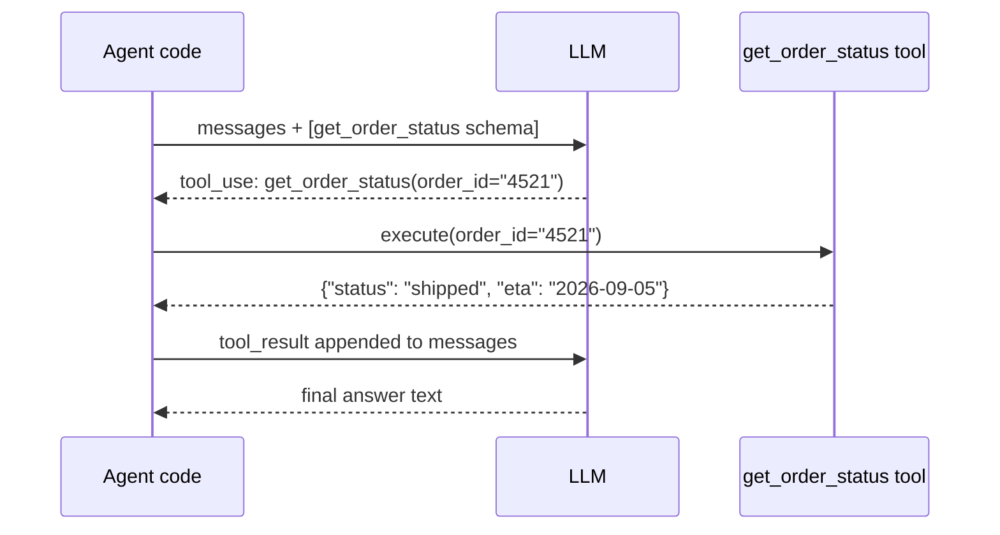

# Tools and MCP — Junior

<!-- level-focus -->
At junior level, focus on this question:

> Given a single capability you want an agent to have, can you write a tool schema for it and trace every hop of a single tool-call round trip — from the model deciding to call it, to your code executing it, to the result coming back?

Use the smallest realistic scenario that exposes the decision and its failure behavior.

---

## Core Concept 1 — What a Tool Actually Is to the Model

A "tool" (also called a "function" — both major model providers' APIs use this framing, e.g. Anthropic's tool use and OpenAI's function calling) is a JSON-schema description included in a request to the model: a name, a natural-language description of what it does, and a schema for its parameters. The model does not execute anything. It reads the available tool schemas, and when it decides a tool is needed, it emits a structured request naming the tool and its arguments. Your code is what actually runs the function and gets a real result.

A minimal schema for the support agent's order-lookup capability:

```json
{
  "name": "get_order_status",
  "description": "Look up the current shipping status and estimated delivery date for a specific order, given its order ID. Use this whenever a user asks about the status, location, or ETA of an order they've already placed.",
  "input_schema": {
    "type": "object",
    "properties": {
      "order_id": {
        "type": "string",
        "description": "The order ID, e.g. '4521'. Do not include a '#' prefix."
      }
    },
    "required": ["order_id"]
  }
}
```

Every field earns its place: the `name` is what the model references when it calls the tool; the `description` is the *only* information the model has about when and why to use it — a vague description ("handles orders") makes the model guess; the `input_schema` constrains what a well-formed call looks like, and its own field-level descriptions (like the `#`-prefix note above) prevent a specific, predictable mistake.

## Core Concept 2 — The Round Trip



Five distinct hops, each owned by a different party:

1. **Agent code sends the request** — the conversation so far, plus the list of available tool schemas.
2. **The model decides to call a tool** and returns a structured request — not text describing what it would do, but a machine-parseable `name` + `arguments` pair your code can act on directly.
3. **Agent code executes the actual function** — this is where the real database query, API call, or computation happens. The model has no visibility into this step at all.
4. **The result is appended back into the conversation** as a new message, in whatever format the API expects a tool result to take.
5. **The model produces its next output** — either another tool call, or a final, user-facing answer — now with the real result available to reason over.

## Core Concept 3 — Tracing It With Real Payloads

User message: `"What's the status of order #4521?"`

**Request 1 (agent code → model):**

```json
{
  "messages": [{"role": "user", "content": "What's the status of order #4521?"}],
  "tools": [{"name": "get_order_status", "input_schema": {"...": "..."}}]
}
```

**Response 1 (model → agent code):**

```json
{
  "stop_reason": "tool_use",
  "content": [{"type": "tool_use", "name": "get_order_status",
               "input": {"order_id": "4521"}}]
}
```

Note the model correctly stripped the `#` prefix per the schema's field description — this is the description doing real work, not decoration.

**Agent code executes** `get_order_status(order_id="4521")` against the real order system, getting back:

```json
{"status": "shipped", "eta": "2026-09-05"}
```

**Request 2 (agent code → model, with the tool result appended):**

```json
{
  "messages": [
    {"role": "user", "content": "What's the status of order #4521?"},
    {"role": "assistant", "content": [{"type": "tool_use", "name": "get_order_status", "input": {"order_id": "4521"}}]},
    {"role": "user", "content": [{"type": "tool_result", "content": "{\"status\": \"shipped\", \"eta\": \"2026-09-05\"}"}]}
  ],
  "tools": [{"name": "get_order_status", "input_schema": {"...": "..."}}]
}
```

**Response 2 (model → agent code):**

```json
{
  "stop_reason": "end_turn",
  "content": [{"type": "text", "text": "Order #4521 has shipped and is expected to arrive by September 5, 2026."}]
}
```

This is the exact same round trip walked through conceptually in the [junior architecture guide](../agent-architectures/junior.md), now shown at the level of the actual API payloads that make it happen.

## Core Concept 4 — Handling Basic Tool Errors

Tools fail — a downstream API times out, an order ID doesn't exist, a database connection drops. At this level, the essential rule is: **a tool error should become a structured observation the model can reason about, not a crash.**

```json
{"error": "not_found", "message": "No order found with ID 4521"}
```

Returning this as the tool result (rather than letting an unhandled exception propagate and kill the agent's turn) lets the model's next Thought reason correctly: "the order wasn't found — I should ask the user to double-check the ID" is a coherent, useful response. A crash gives the model nothing to reason about at all.

## Common Mistakes

1. **Writing a vague tool description.** "Handles order stuff" tells the model nothing about *when* to call it versus a different tool, or what a correct argument looks like — the model will guess, and guess wrong on ambiguous cases.
2. **Returning large, unstructured blobs as tool results.** Dumping an entire raw API response (hundreds of fields) as the tool result wastes context and makes it harder for the model to find the one or two fields that actually matter. Return only what's relevant to the tool's stated purpose.
3. **Not handling the case where the model requests a tool that doesn't exist or is misspelled.** This happens more than expected, especially with a large tool list — agent code needs an explicit branch for "the model asked for something I don't recognize," not an assumption every tool_use will match a known name.
4. **Conflating "the model called the tool" with "the tool executed successfully."** These are two separate events on two separate hops (Core Concept 2, steps 2 and 3) — a tool_use request is not itself evidence that anything actually happened yet.

## Apply It

1. Pick one real capability you want an agent to have, and write its full tool schema: name, a description specific enough that a different plausible tool name wouldn't be confused with it, and a parameter schema with field-level descriptions for anything non-obvious.
2. Write out the five-hop round trip from Core Concept 2 using your own schema, with realistic example values at each hop.
3. Deliberately write what your tool's error result looks like for one realistic failure case (not found, invalid input, timeout), and write the model's plausible next Thought given that structured error.
4. Identify one field in your schema's description that, if removed, would make a specific, predictable mistake more likely — and explain what that mistake would be.

## Verify Your Work

- Your tool's description states specifically when to use it, not just what it technically does.
- Your round-trip trace shows all five hops distinctly — request-with-tools, tool_use response, execution, tool_result, final answer — not collapsed into fewer steps.
- Your error-handling example returns a structured result the model can reason over, not a raw exception or crash.
- You can point to one field-level description in your schema and explain the specific mistake it prevents.
- You can state, in one sentence, why the model itself never executes the tool.

## Review Questions

- What does the model actually receive about a tool, and what does it never see?
- Why does a tool's description matter as much as its parameter schema for getting correct behavior?
- Walk through the five hops of a tool-call round trip — who performs each one?
- Why should a tool error be returned as a structured result instead of allowed to crash the agent's turn?
- What's the practical difference between "the model called the tool" and "the tool executed successfully," and why does conflating them cause bugs?
