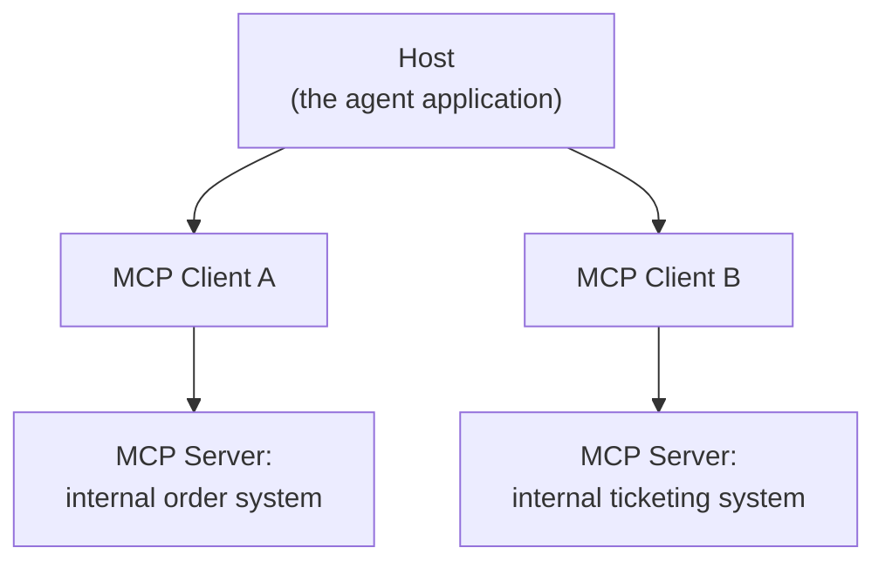

# Tools and MCP — Middle

<!-- level-focus -->
At middle level, focus on this question:

> What specific problem does the Model Context Protocol solve that plain tool schemas don't, and can you build or integrate an MCP server for a real capability and connect it to an agent, verifying it at both the server level and the integrated-agent level?

Use the smallest realistic scenario that exposes the decision and its failure behavior.

---

## Core Concept 1 — The Problem Before MCP

The junior-level tool schema works fine for one agent calling one hand-written function. It stops scaling the moment you have multiple agent applications (a custom support bot, an internal chat client, an IDE assistant) that all want to call the *same* external capability — an internal order database, a ticketing system, a file store. Without a shared protocol, each pairing of (agent host, external system) needs its own bespoke integration code: N hosts times M systems means N×M separate integrations, each maintained independently, each re-solving the same problems (authentication, schema translation, error handling) slightly differently.

The **Model Context Protocol (MCP)**, an open protocol introduced by Anthropic, standardizes this. An MCP server exposes a set of tools (and other capabilities — resources, prompts) over a common protocol; any MCP-compatible client can discover and call them without custom glue code written specifically for that pairing. The integration problem collapses from N×M bespoke integrations to N clients and M servers, each implementing the protocol once.

## Core Concept 2 — Host, Client, Server

Three roles, often confused:



- **Host** — the application the end user actually interacts with (a support-agent app, an IDE, a chat client). It's what orchestrates the agent loop.
- **Client** — the connector living inside the host that speaks the MCP protocol to one specific server. A host typically runs one client per server it connects to.
- **Server** — a separate process that exposes tools (and optionally resources and prompts) over MCP, usually over a local `stdio` transport (the server runs as a subprocess) or over HTTP/SSE for a remote server.

The host doesn't need custom code per server beyond configuring which servers to connect to — the client handles discovery (asking the server "what tools do you have?") and invocation using the same protocol regardless of which server it's talking to.

## Core Concept 3 — Building a Minimal Custom Server

For the support agent's order-lookup capability, wrapping it as an MCP server (rather than a hand-written function called directly, as at junior level) makes it usable by *any* MCP-compatible host, not just this one agent's code:

```python
# order_server.py — a minimal MCP server exposing one tool
from mcp.server import Server
import mcp.types as types

server = Server("order-lookup")

@server.list_tools()
async def list_tools():
    return [
        types.Tool(
            name="get_order_status",
            description="Look up shipping status and ETA for an order by ID.",
            inputSchema={
                "type": "object",
                "properties": {"order_id": {"type": "string"}},
                "required": ["order_id"],
            },
        )
    ]

@server.call_tool()
async def call_tool(name: str, arguments: dict):
    if name == "get_order_status":
        result = internal_order_api.lookup(arguments["order_id"])
        return [types.TextContent(type="text", text=json.dumps(result))]
    raise ValueError(f"Unknown tool: {name}")
```

The host's configuration then just points at this server (as a subprocess command, for a local `stdio` server) — no host-side code needs to know the internal order API exists at all. The client discovers `get_order_status` by calling `list_tools()` and invokes it by calling `call_tool()`, both standard MCP operations regardless of what's behind them.

## Core Concept 4 — Build Custom vs. Use an Existing Server

| Situation | Choice |
|---|---|
| Connecting to a well-known third-party system (version control, a cloud storage provider, a project-tracking tool) | Use an existing, published MCP server for it — the ecosystem has already built and maintained the integration; building your own duplicates that work and now you own its maintenance |
| The capability is internal and proprietary (your own order database, an internal-only API) | Build a custom server — no existing server can know about your internal system |
| An existing server exposes far more surface than you want an agent to have access to | Build a narrower custom server (or a scoped wrapper in front of the existing one) — this is a security decision as much as a technical one, covered in depth at senior level |

The decision isn't "always build" or "always use existing" — it's driven by whether the capability is generic (someone else likely already solved it) or proprietary (nobody else could have).

## Core Concept 5 — Verification at Two Levels

**Unit level — the server, independent of any agent.** Use an MCP inspector or dev tool to connect directly to the server, call `list_tools()`, and confirm the schema matches what you intended; call `call_tool("get_order_status", {"order_id": "4521"})` directly and confirm it returns a correct result. This verifies the server works at all, with no agent or model involved yet — isolating "is the server correct" from "does the agent use it correctly."

**Integrated-flow level — through the actual agent host.** Connect the host to the server, send a real user prompt through the whole system ("What's the status of order #4521?"), and confirm the round trip from the [junior guide](junior.md) completes correctly end to end — the model discovers the tool via the client, decides to call it, the server executes it, and the result comes back and produces a correct final answer.

A common trap: the server passes every direct unit-level test, but the integrated flow fails because the tool's *description* (which only matters once a model is choosing among multiple tools) is ambiguous against other tools already available to that host — a failure mode invisible to a unit test that only ever calls the tool it already knows it wants.

## Common Mistakes

- **Exposing an entire internal API 1:1 as MCP tools without curation.** Wrapping fifty endpoints as fifty tools with no consolidation gives the model fifty overlapping, ambiguous choices — precisely the tool-selection confusion problem from the [middle-level architecture guide](../agent-architectures/middle.md), just introduced via MCP instead of hand-written schemas. Curate: expose the handful of tools that map to real, distinct tasks.
- **Not versioning the server.** A server with no version identifier makes it impossible to know, when something breaks, whether the server's behavior changed underneath a consuming host.
- **Treating resources and tools as interchangeable.** MCP resources are data a client can read or attach to context (a file, a document); tools are actions the model can invoke. Exposing something that's really just readable data as a tool (or vice versa) confuses the protocol's own model of what each capability is for.
- **Skipping unit-level verification of the server itself.** Debugging "why doesn't the agent get the right order status" by only ever testing through the full agent stack makes it much harder to isolate whether the bug is in the server, the client, or the model's tool selection.

---

## Apply It

1. Pick a real capability you have access to (an internal API, a file store, a simple database) and design it as an MCP server: list the tools it should expose, and for each, write the schema and a description specific enough to disambiguate it from anything else the host might have.
2. Implement (or pseudocode in detail) the server's `list_tools` and `call_tool` handlers.
3. Verify the server directly, independent of any agent — call each tool with valid and invalid arguments and confirm the results and error handling are correct.
4. Connect a host/agent to the server and run at least three realistic end-to-end prompts, confirming the full round trip completes correctly.
5. Decide, and write down the reasoning, whether this capability should have been built as a custom server or whether an existing published MCP server already covers it.

## Verify Your Work

- The server's tool list, checked directly via `list_tools()`, matches your design exactly — no missing or unintended tools.
- Direct `call_tool()` invocations with valid arguments return correct results, and invalid arguments return a structured error, not a crash.
- The integrated end-to-end test with a real host produces correct final answers for all three realistic prompts.
- You can name one way a unit-level pass could still hide an integrated-flow failure (an ambiguous description against other tools the host has).
- Your build-vs-use decision names the specific reason (proprietary internal system vs. generic well-covered capability) rather than a default preference.

## Review Questions

- What specific integration problem does MCP solve that a one-off hand-written tool schema doesn't?
- What are the distinct responsibilities of a Host, a Client, and a Server in MCP, and why does a host typically run one client per server?
- When is building a custom MCP server the right call versus using an existing published one?
- Why can a server pass every unit-level test and still fail once connected to a real agent host?
- What's the practical difference between an MCP resource and an MCP tool, and why does conflating them cause design confusion?
