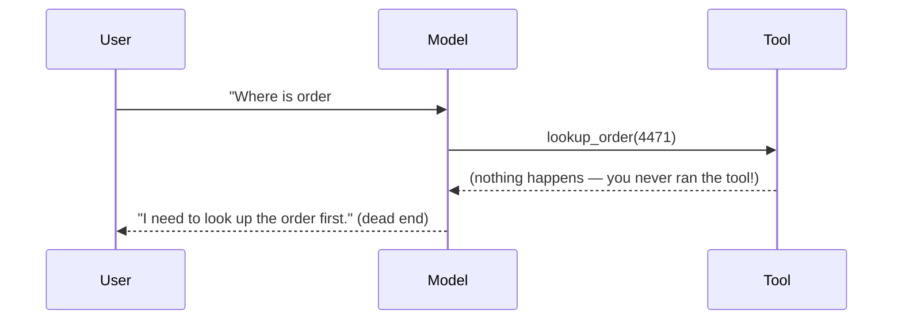

# AI Agents 101 — Junior

## What is an agent?

A plain LLM call is a vending machine: one input, one output, done. An **agent**
wraps the LLM in a loop and gives it a toolbox — a search API, a database
query, a shell — so it can gather information or take actions across multiple
steps before answering.

The core idea: instead of asking the model to answer directly, you ask it to
decide, on each turn, whether it has enough information to answer, or whether
it should call a tool first and look at the result.

## The naive first approach: one tool call

Say you're building a support bot that needs to look up a customer's order
status. The obvious first attempt:

```python
response = client.messages.create(
    model="claude-opus-4-5",
    tools=[order_lookup_tool],
    messages=[{"role": "user", "content": "Where is order #4471?"}]
)
```

This works for a single lookup. The model sees the question, calls
`order_lookup_tool`, and you're done... except you're not done. The API
returns a `tool_use` block, not an answer. You still have to run the tool
yourself, feed the result back, and ask the model again.

## Why it breaks: one call isn't enough



A single request/response cycle can't:

1. **Chain steps** — "look up the order, then check if it's late, then issue
   a refund" needs the *result* of step 1 before step 2 can even be decided.
2. **React to failure** — if the lookup tool times out, only a second model
   call (with the error fed back in) can decide what to do next.
3. **Stop at the right time** — the model needs to see its own tool results
   to know whether it's actually done or needs another step.

Even a "simple" two-step task requires: call model → get `tool_use` → execute
the tool in your own code → send the result back → call the model again. That
loop, run until the model has no more tools to call, *is* the agent.

## Test yourself

1. What's the difference between a single LLM API call and an "agent"?
2. In the sequence diagram above, why does the flow dead-end after the tool
   call?
3. Why can't the model execute the tool itself — who is actually responsible
   for calling `order_lookup_tool`?
4. Sketch (in words) the missing steps needed to make the refund example
   above actually work end-to-end.

Continue to [`middle.md`](middle.md).
