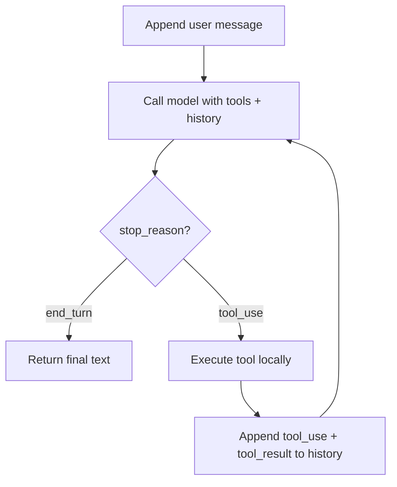

# AI Agents 101 — Middle

## The real mechanism: the agent loop

Every agent, regardless of framework, boils down to the same loop:



The model never runs anything. It emits a `tool_use` block describing *which*
tool and *what arguments*; your code executes it and appends the result to
the conversation as a `tool_result`. The model only "sees" the next step once
you send that result back in a follow-up call.

## Worked example: a two-step agent

```python
from anthropic import Anthropic

client = Anthropic()

tools = [{
    "name": "lookup_order",
    "description": "Look up an order's status and delivery date by ID.",
    "input_schema": {
        "type": "object",
        "properties": {"order_id": {"type": "string"}},
        "required": ["order_id"],
    },
}]

def lookup_order(order_id: str) -> str:
    return '{"status": "shipped", "days_late": 3}'  # pretend DB call

def run_agent(user_input: str, max_steps: int = 5) -> str:
    messages = [{"role": "user", "content": user_input}]

    for _ in range(max_steps):
        response = client.messages.create(
            model="claude-opus-4-5",
            max_tokens=1024,
            tools=tools,
            messages=messages,
        )

        if response.stop_reason == "end_turn":
            return response.content[0].text

        messages.append({"role": "assistant", "content": response.content})
        tool_results = []
        for block in response.content:
            if block.type == "tool_use":
                result = lookup_order(**block.input)
                tool_results.append({
                    "type": "tool_result",
                    "tool_use_id": block.id,
                    "content": result,
                })
        messages.append({"role": "user", "content": tool_results})

    return "Gave up after max_steps."
```

Run this with `"Is order 4471 late, and by how much?"` and trace it by hand:
turn 1 the model calls `lookup_order`, your code runs it and appends the
JSON result, turn 2 the model reads `days_late: 3` and answers in text —
`stop_reason` flips to `end_turn` and the loop returns.

## Decision table: when do you actually need a loop?

| Task shape | Loop needed? | Why |
|---|---|---|
| "Summarize this text" | No | No external data required |
| "What's the weather in Paris?" | One tool call, still a loop | Model needs the tool result before answering |
| "Refund the order if it's 3+ days late" | Yes, 2+ steps | Decision in step 2 depends on data from step 1 |
| "Research topic X and write a report" | Yes, open-ended | Number of steps isn't known ahead of time |

## Test yourself

1. Why does `run_agent` need a `max_steps` guard even though the loop *should*
   terminate on `end_turn`?
2. What would happen if you forgot the line that appends `tool_results` back
   into `messages`?
3. In the decision table, why does "What's the weather in Paris?" still need
   a loop even though it's only one tool call?
4. Modify the worked example (in words) so it also calls a `refund_order`
   tool when `days_late > 2`.

Continue to [`senior.md`](senior.md).
