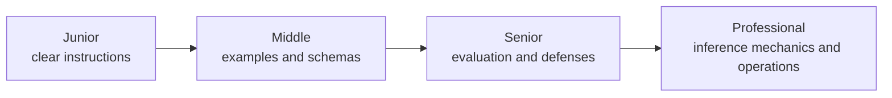
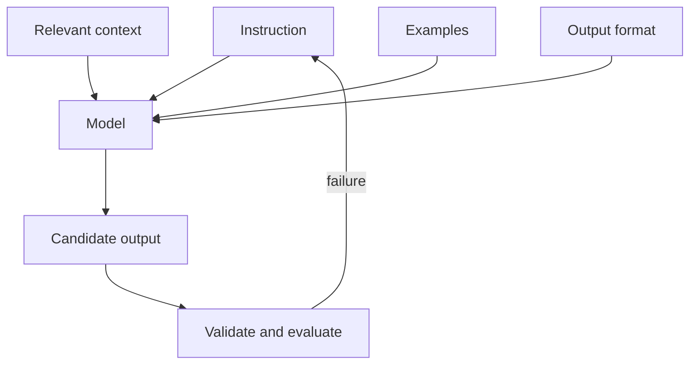

# Prompt Engineering

> A production prompt is a versioned task contract, not a clever sentence.

## Levels

| Level | Guide | You are done when... |
|---|---|---|
| Junior | [junior.md](junior.md) | You can turn a vague request into a specific instruction with context and an explicit format |
| Middle | [middle.md](middle.md) | You can use examples, delimiters, and schemas without overloading the prompt |
| Senior | [senior.md](senior.md) | You can version prompts, evaluate regressions, and isolate untrusted content |
| Professional | [professional.md](professional.md) | You can reason about instruction hierarchy, constrained decoding, caching, and fleet-wide prompt operations |

## Practice rule

Keep a fixed test set. Change one prompt variable at a time and compare results; intuition without evaluation is not engineering.

## Related

- [AI Agents 101](../03-ai-agents-101/)
- [Tools / Actions](../05-tools-actions/)
- [Evaluation and Testing](../10-evaluation-and-testing/)
- [Security and Ethics](../12-security-ethics/)
