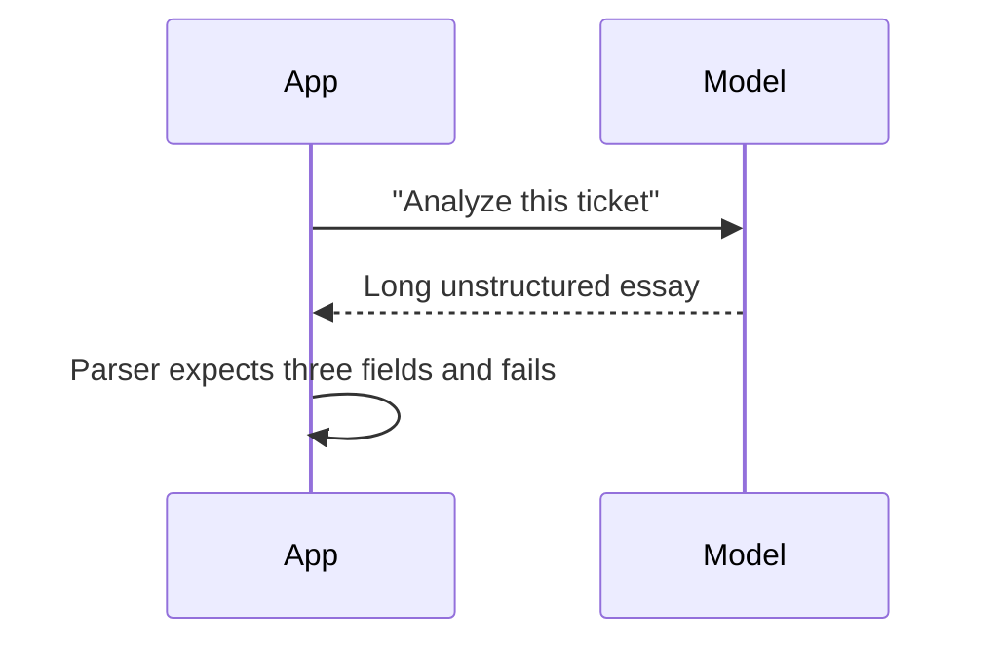

# Prompt Engineering - Junior

## Start with a task contract

Prompt engineering is the practice of expressing a task so a model can act on
the right information and return a usable result. A good prompt answers four
questions:

1. What must be done?
2. What context is relevant?
3. What constraints must be respected?
4. What should the output look like?

Compare `Summarize this` with:

```text
Summarize the support ticket between <ticket> tags for an on-call engineer.
Return exactly three bullets: symptom, likely cause, and next action.
Do not invent facts that are absent from the ticket.

<ticket>{{ticket_text}}</ticket>
```

The second prompt identifies the audience, separates data from instructions,
sets a format, and defines what to do when evidence is missing.

## The naive approach

Teams often keep adding adjectives: "be accurate, insightful, professional,
and extremely careful." These words do not define observable success. The
model may produce polished prose while omitting the next action your system
needs.



Replace subjective wishes with checkable requirements. Prefer "return a JSON
object with `symptom`, `cause`, and `next_action`" over "be concise and
helpful."

## Useful beginner techniques

- Put the task before a large context block.
- Delimit user or retrieved text with XML tags or fenced sections.
- State the audience and desired level of detail.
- Give a small example when format cannot be described clearly.
- Say what to do when information is unknown.
- Never assume a prompt can guarantee truth; validate important outputs.

## Test yourself

1. Which four questions should a task contract answer?
2. Why is "be accurate" weaker than "do not invent absent facts"?
3. Rewrite "classify this email" so its allowed labels and output format are explicit.
4. Why should external text be delimited from instructions?

Continue to [`middle.md`](middle.md).
