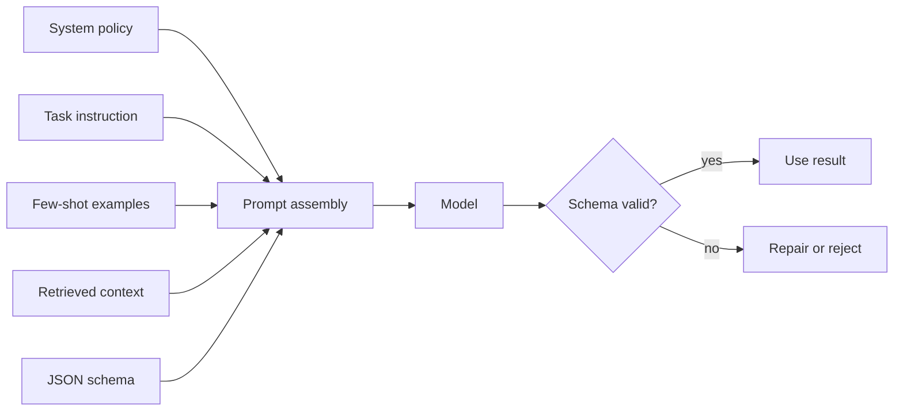

# Prompt Engineering - Middle

## Compose prompts from explicit parts

A maintainable prompt usually has separate instruction, context, examples,
and output-contract sections. This makes failures diagnosable: you can tell
whether the model misunderstood the task, lacked evidence, or emitted an
invalid shape.



## Worked example: structured triage

```python
import json

LABELS = ["billing", "bug", "account", "other"]

def build_prompt(ticket: str) -> str:
    return f"""Classify one support ticket.
Allowed labels: {json.dumps(LABELS)}
Return JSON with keys `label` and `reason`. The reason must cite ticket text.

Example:
<ticket>I was charged twice</ticket>
<answer>{{"label":"billing","reason":"charged twice"}}</answer>

<ticket>{ticket}</ticket>"""
```

One representative example teaches both semantics and shape. Ten repetitive
examples waste context and may bias the model toward superficial wording.

## Choose the right control

| Need | Technique | Limitation |
|---|---|---|
| Clarify a task | Direct instruction | Cannot supply missing knowledge |
| Demonstrate a boundary | Few-shot examples | Consumes context and can overfit |
| Ground an answer | Retrieved context | Retrieved text may be wrong or hostile |
| Machine-readable output | Schema / constrained output | Valid structure can still contain false facts |
| Stable classification | Low temperature plus labels | Does not make inference fully deterministic |

## Iterate with evidence

Create a dataset containing normal cases, ambiguous cases, malformed input,
and adversarial input. Record prompt version, model version, parameters, raw
response, parsed response, latency, and token use. A prompt change is an
experiment only when you can compare it against a baseline.

## Test yourself

1. Why should prompt sections be assembled separately?
2. What does the example in `build_prompt` teach beyond the label itself?
3. Why can schema-valid output still be unsafe?
4. When would retrieval solve a problem that better wording cannot?

Continue to [`senior.md`](senior.md).
