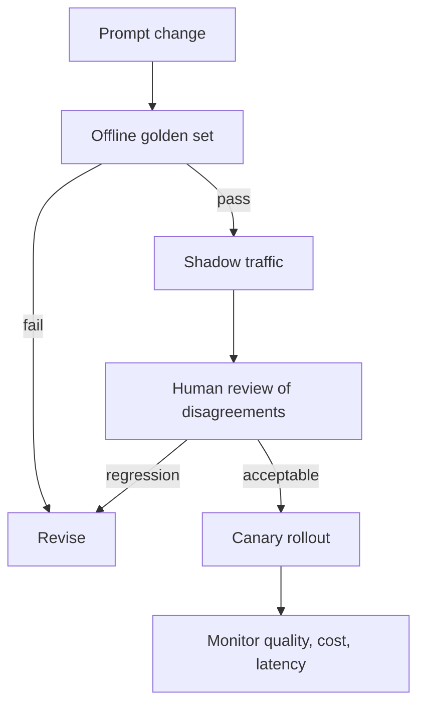

# Prompt Engineering - Senior

## Treat prompts as production artifacts

The middle-level prompt can regress when the model, retrieval corpus, tool
descriptions, or surrounding application changes. Store prompts in source
control, assign immutable versions, and attach every production trace to the
exact prompt and model configuration that produced it.

## Failure modes and controls

| Failure | Typical symptom | Control |
|---|---|---|
| Instruction ambiguity | Correct-looking but inconsistent answers | Define precedence and acceptance criteria |
| Prompt injection | Retrieved text changes agent behavior | Label data as untrusted and enforce capabilities outside the model |
| Example overfitting | Model copies irrelevant example details | Diversify examples and test held-out cases |
| Context dilution | Important rule is ignored in long input | Remove noise; repeat only critical, nonconflicting constraints |
| Model migration | Quality shifts after an upgrade | Shadow evaluation and staged rollout |

Prompt text is not a security boundary. If the model proposes `delete_user`,
application code must still authorize the caller, validate arguments, and
require confirmation. "Never delete without permission" in a system prompt
is useful guidance, not access control.

## Build an evaluation gate

Use exact-match or schema checks where possible, semantic graders where
necessary, and human review for high-impact ambiguity. Never collapse all
quality into one average: report slices such as language, ticket category,
input length, and adversarial cases. A 2% average gain can hide a severe
regression for one customer group.

## Operational trade-offs

- More context may improve recall but raises cost, latency, and injection surface.
- More examples may stabilize behavior but make updates harder to reason about.
- Self-critique adds another chance to correct errors and another chance to invent them.
- Model-based judges scale review but inherit model bias and require calibration.

## Test yourself

1. Which identifiers must be stored with every model trace for reproduction?
2. Why is a system-prompt prohibition not authorization?
3. Design three evaluation slices for a multilingual support classifier.
4. What evidence would you require before migrating a prompt to a new model?

Continue to [`professional.md`](professional.md).
