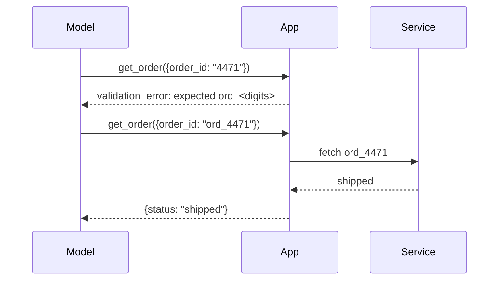

# Tools and Actions - Junior

## What is a tool?

A tool is an application-owned function the model may request. The model does
not execute it. It emits a name and arguments; your program validates the
request, runs code, and returns the result to the model.

```json
{
  "name": "get_order",
  "description": "Read one order by its public order ID.",
  "input_schema": {
    "type": "object",
    "properties": {
      "order_id": {"type": "string", "pattern": "^ord_[0-9]+$"}
    },
    "required": ["order_id"],
    "additionalProperties": false
  }
}
```

Names should describe one operation. Descriptions should state when to use
the tool and important boundaries. Schemas should reject missing, malformed,
or extra input before application code sees it.

## Why a vague tool breaks

`database(query: string)` appears flexible but gives the model excessive
power, exposes internal schema, and mixes reading with destructive writes.
Use narrow tools such as `get_order`, `list_customer_orders`, and
`request_refund` with distinct permissions.



Errors are observations, not exceptions to hide. Return a stable error code,
a safe message, and whether retrying could help. Never return secrets, stack
traces, or pretend an operation succeeded.

## Common tool categories

- Read-only: web search, database lookup, file read.
- Compute: calculator, code execution, image processing.
- Side effect: send message, update record, create payment.
- Destructive: delete data, revoke access; require stronger approval.

## Test yourself

1. Who actually executes a model-requested tool?
2. What is unsafe about a generic `database(query)` tool?
3. Which fields would you return for a retryable timeout?
4. Classify `send_email` and `read_file` by capability type.

Continue to [`middle.md`](middle.md).
