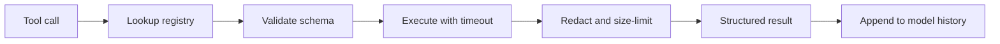

# Tools and Actions - Middle

## Build a validated dispatcher

Keep model-facing schemas, validation, execution, and result serialization in
one registry. Do not dispatch with `globals()` or allow the model to provide
module names, URLs, SQL, or shell commands unless that power is explicitly
required and contained.

```python
from dataclasses import dataclass
from typing import Callable
from pydantic import BaseModel, Field, ValidationError

class GetOrderArgs(BaseModel):
    order_id: str = Field(pattern=r"^ord_[0-9]+$")

@dataclass
class Tool:
    args: type[BaseModel]
    execute: Callable[..., dict]

TOOLS = {"get_order": Tool(GetOrderArgs, get_order)}

def dispatch(name: str, raw: dict) -> dict:
    tool = TOOLS.get(name)
    if not tool:
        return {"ok": False, "code": "unknown_tool", "retryable": False}
    try:
        args = tool.args.model_validate(raw)
        return {"ok": True, "data": tool.execute(**args.model_dump())}
    except ValidationError as error:
        return {"ok": False, "code": "invalid_arguments",
                "details": error.errors(), "retryable": False}
    except TimeoutError:
        return {"ok": False, "code": "timeout", "retryable": True}
```

## Tool-result lifecycle



Give each call an ID and attach it to logs, traces, and results. Set a timeout
per tool, bound output size, redact secrets, and preserve enough structure
that the model can distinguish empty data from a failure.

## Tool-design decisions

| Decision | Prefer | Avoid |
|---|---|---|
| Scope | One business operation | General shell or SQL access |
| Arguments | Enums, IDs, bounded strings | Free-form command blobs |
| Result | Stable typed envelope | Human prose only |
| Failure | Code plus retryability | Empty string or leaked exception |
| Side effects | Dry-run and idempotency key | Implicit immediate execution |

Parallelize independent read tools, but preserve ordering for dependent or
side-effecting calls. A retry policy belongs to the executor because only it
knows whether an operation is safe to repeat.

## Test yourself

1. Why is registry dispatch safer than dynamic function lookup?
2. Where should timeouts and output-size limits be enforced?
3. Why must empty data and execution failure have different results?
4. Which tool calls may safely run in parallel?

Continue to [`senior.md`](senior.md).
