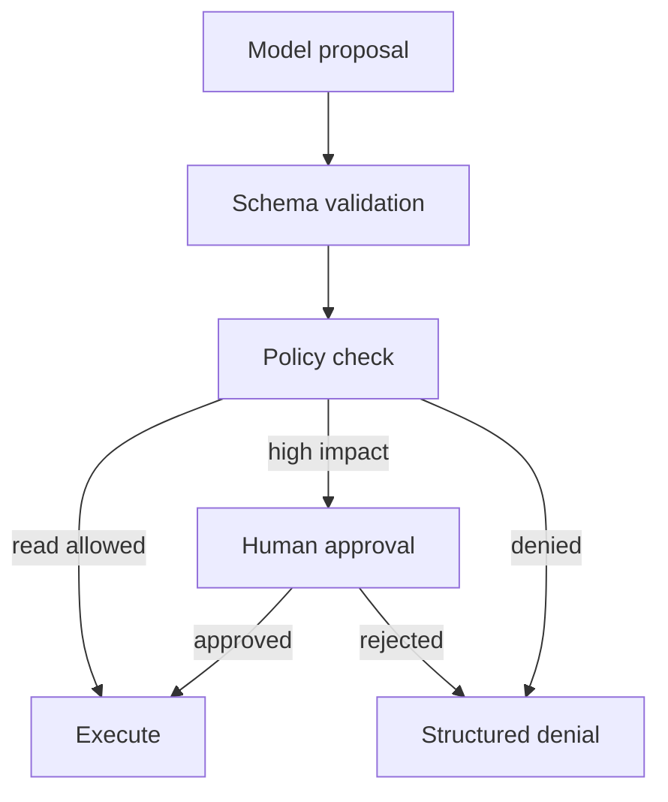

# Tools and Actions - Senior

## Treat tools as capability boundaries

The model proposes actions; policy code decides whether they are allowed.
Authorization must use the authenticated principal, tenant, resource, and
action, not claims written by the model into tool arguments.

## Production failure modes

| Failure | Consequence | Control |
|---|---|---|
| Duplicate retry | Two payments or messages | Caller-supplied idempotency key |
| Prompt-injected arguments | Unauthorized target or payload | Policy outside model plus allow-lists |
| Tool output injection | Model follows hostile returned text | Label as untrusted; restrict subsequent capabilities |
| Code-execution escape | Host compromise | Isolated process/VM, no ambient credentials, quotas |
| Partial success | Model reports failure although action happened | Durable operation record and status lookup |

Side-effecting tools should expose a two-phase interface when impact is high:
`prepare_transfer` returns an immutable preview and approval token;
`commit_transfer(token)` verifies authorization and commits once. The model
cannot rewrite amount or recipient after approval.

## Make retries safe

Store `(tenant, tool, idempotency_key)` with request hash and final outcome.
The same key and same request returns the original result; the same key with
different arguments is rejected. This handles the critical ambiguity where

For code execution and filesystem access, isolate CPU, memory, wall time,
network, mounts, and credentials. An allow-listed command in the host process
is not equivalent to a sandbox; parsers, interpreters, and child processes
create alternate paths.

## Test yourself

1. Why must authorization ignore model-supplied identity claims?
2. Design an idempotency record for `send_email`.
3. What does the two-phase transfer pattern prevent?
4. Which resources must a code-execution sandbox constrain?

Continue to [`professional.md`](professional.md).
