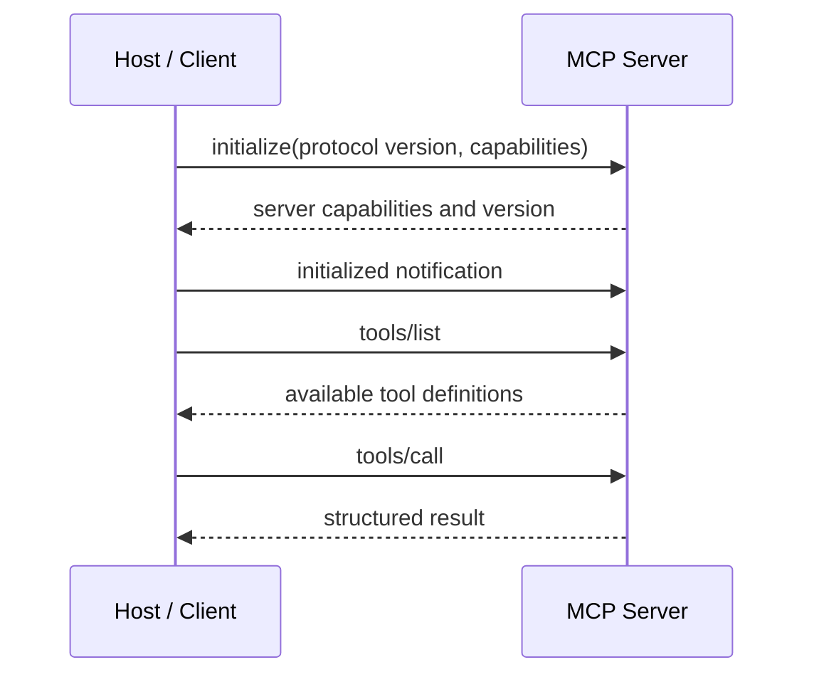

# Model Context Protocol (MCP) - Junior

## The integration problem

Without a shared protocol, every AI application needs custom code for every
data source and action. MCP defines a common message format and lifecycle so a
compatible host can connect to many servers.

- **Host**: the AI application, such as an IDE or desktop assistant.
- **Client**: the host-side connection to one MCP server.
- **Server**: a program that exposes capabilities.
- **Tool**: an operation the model may request.
- **Resource**: context the application may read, identified by a URI.
- **Prompt**: a reusable prompt template the server publishes.

One host can create multiple clients, normally one per server. This separation
lets the host apply different permissions and isolate failures.

## Connection lifecycle

The initialization exchange negotiates protocol versions and capabilities.
The host should not call features the server did not advertise.

## Local and remote deployment

Local servers commonly communicate over **stdio**: the host starts a child
process and exchanges protocol messages over standard input/output. Remote
servers commonly use **Streamable HTTP**, requiring normal network security,
authentication, and origin controls.

The naive mistake is to install an unknown local server because it "only
reads files." That process runs with whatever filesystem, environment, and
network access the host gives it. MCP describes communication; it does not
sandbox the process or certify its behavior.

## Test yourself

1. What is the difference between an MCP host and an MCP client?
2. Which primitive represents readable context rather than an action?
3. What is negotiated during initialization?
4. Why is a local stdio server still a security risk?

Continue to [`middle.md`](middle.md).
