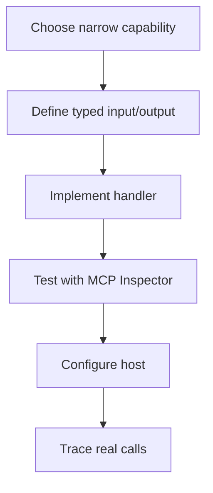

# Model Context Protocol (MCP) - Middle

## Build a focused server

Use an official SDK rather than hand-writing JSON-RPC framing. This Python
example exposes one read-only tool; exact SDK imports can vary by release, so
pin the SDK and consult its matching documentation.

```python
from mcp.server.fastmcp import FastMCP

mcp = FastMCP("support-kb")

@mcp.tool()
def lookup_article(article_id: str) -> dict:
    """Read a public support article by ID."""
    if not article_id.startswith("kb-"):
        return {"ok": False, "code": "invalid_id"}
    article = repository.get(article_id)
    return {"ok": True, "article": article}

if __name__ == "__main__":
    mcp.run(transport="stdio")
```

The docstring becomes model-visible description, so make boundaries clear.
Validate again inside the handler; model-generated arguments are untrusted.

## Server design workflow



Use resources for addressable, mostly read-oriented context such as
`kb://articles/kb-42`. Use tools when execution or parameterized computation
is required. Use prompts for user-selectable workflow templates, not hidden
security policy.

## Transport decision

| Transport | Best fit | Main concern |
|---|---|---|
| stdio | Local child process, one host | Process permissions and log framing |
| Streamable HTTP | Shared remote service | Authentication, sessions, origins, capacity |

Never write logs to stdout in a stdio server because they corrupt protocol
framing; write diagnostics to stderr. For either transport, return structured
errors, cap response size, and avoid leaking stack traces or credentials.

## Test yourself

1. Why should an SDK be pinned with its protocol documentation?
2. When should a capability be a resource instead of a tool?
3. Why must stdio diagnostics use stderr?
4. What additional controls does a remote deployment require?

Continue to [`senior.md`](senior.md).
