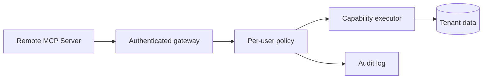

# Model Context Protocol (MCP) - Senior

## Design around trust boundaries

An MCP server can expose data, request model sampling, or trigger side
effects. Capability discovery is not authorization. The host must present
capabilities transparently, obtain consent where needed, and enforce policy
outside model reasoning.

## Failure and attack modes

| Risk | Example | Control |
|---|---|---|
| Confused deputy | Server causes host to access another tenant | Bind identity and audience at every hop |
| Token passthrough | Server forwards a host token downstream | Exchange for scoped, audience-bound credentials |
| Tool poisoning | Description hides destructive behavior | Review, pin, and allow-list server capabilities |
| SSRF / DNS rebinding | User supplies a malicious remote URL | Validate URLs, origins, redirects, and resolved addresses |
| Session hijack | Another client reuses a session identifier | Authenticate requests; never treat session ID as auth |
| Version drift | Client assumes unsupported behavior | Negotiate, test compatibility, fail closed |

For remote authorization, follow the current MCP authorization specification
and OAuth guidance rather than inventing bearer-token forwarding. Separate
user consent to connect from per-action approval for consequential tools.

## Lifecycle and resilience

Treat capability lists as dynamic. Servers can notify clients that tools or
resources changed; clients should refresh safely without retaining stale
privileges. Bound concurrent calls per server and propagate deadlines and
cancellation. A failed server must degrade one integration, not the entire
host.

Pin local server package versions and configuration hashes. Auto-updating an
executable with filesystem access turns a dependency compromise into immediate
host compromise. Run it with the minimum environment, mounts, and network.

## Test yourself

1. Why is an MCP session identifier not an authentication credential?
2. Describe the confused-deputy risk in a multi-tenant MCP server.
3. How should a host react when a server's capability list changes?
4. Which permissions should a local filesystem server process receive?

Continue to [`professional.md`](professional.md).
