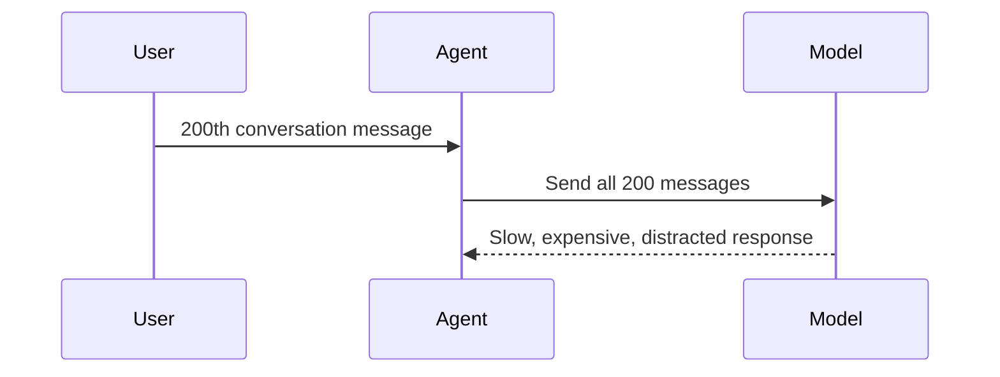

# Agent Memory - Junior

## Models do not remember by themselves

An API model only sees the input sent on the current call. An application
creates the appearance of memory by including previous messages or retrieving
stored information and adding it to the prompt.

- **Working memory**: recent messages and intermediate state in the context window.
- **Episodic memory**: records of events, such as "the user rejected option A yesterday."
- **Semantic memory**: durable facts or preferences, such as "the user prefers Celsius."

Working memory is fast to use but limited by the context window. Long-term
memory can persist across sessions but must be written, searched, and deleted
by application code.

## The naive approach: replay everything

Full replay eventually exceeds context limits, increases cost, and lets old
irrelevant instructions compete with current intent. It also retains private
data indefinitely without a reason.

## A better mental model

Treat memory as notes, not a transcript. Before writing a memory, ask:

1. Is it likely to matter later?
2. Is it a fact, preference, event, or temporary task state?
3. Did the user provide it, or did the model infer it?
4. How long should it remain valid?
5. May this data be stored at all?

Inferred memories should be labeled with provenance and confidence. "User
lives in Paris" is unsafe if the user merely asked about Paris weather.

## Test yourself

1. Why does an API model not remember a previous call automatically?
2. Classify "user chose plan B on Tuesday" as episodic or semantic.
3. Name three problems caused by replaying the full transcript forever.
4. Why must inferred facts preserve provenance?

Continue to [`middle.md`](middle.md).
