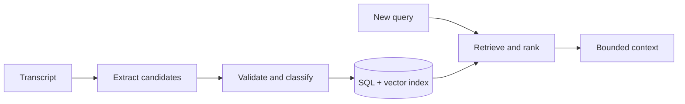

# Agent Memory - Middle

## Separate the write path from the read path

After an interaction, a memory extractor proposes compact records. Validation
and policy decide what to store. Before a new model call, retrieval selects a
small set using relevance, recency, importance, tenant, and access filters.



## Worked record and retrieval

```python
from dataclasses import dataclass
from datetime import datetime

@dataclass
class Memory:
    user_id: str
    kind: str
    text: str
    source_message_id: str
    created_at: datetime
    expires_at: datetime | None

def retrieve(user_id: str, query: str, limit: int = 5) -> list[Memory]:
    candidates = store.semantic_search(user_id=user_id, query=query, limit=20)
    valid = [m for m in candidates if not m.expires_at or m.expires_at > now()]
    return rerank(query, valid)[:limit]
```

SQL is useful for identity, filtering, updates, consent, and deletion. Vector
search is useful for fuzzy relevance. Most production designs need both; a
vector database alone is not a user-profile authority.

## Maintenance strategies

| Strategy | Use | Risk |
|---|---|---|
| Recent-message window | Preserve local conversational flow | Drops older commitments |
| Summarization | Compress long sessions | Summary can omit or distort facts |
| Semantic retrieval | Find related past events | Similarity is not importance or truth |
| Profile fields | Store stable preferences explicitly | Staleness and contradiction |
| TTL / aging | Remove temporary state | Useful memory may disappear too early |

Do not let the model silently overwrite authoritative fields. Record a new
claim, resolve contradictions with deterministic rules or user confirmation,
and retain source IDs for correction and deletion.

## Test yourself

1. Why should memory extraction and retrieval be separate paths?
2. What does SQL provide that vector similarity does not?
3. Why is a conversation summary not an authoritative fact store?
4. How would you resolve two conflicting timezone preferences?

Continue to [`senior.md`](senior.md).
