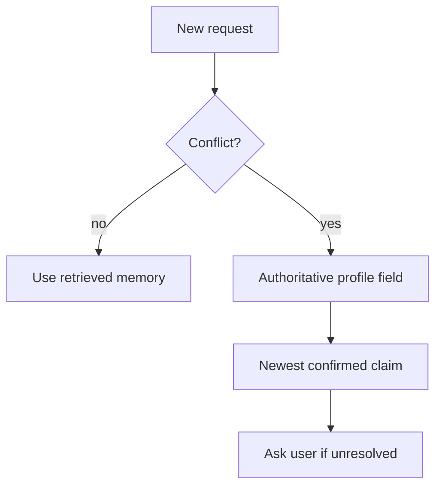

# Agent Memory - Senior

## Memory is an attack and quality surface

A bad response is temporary; a bad stored memory can corrupt every future
response. Treat writes as durable state changes with policy, provenance,
validation, observability, and user correction.

## Failure modes

| Failure | Symptom | Control |
|---|---|---|
| Memory poisoning | Hostile content persists as a trusted rule | Separate facts from instructions; restrict writers |
| Stale preference | Agent repeatedly applies an old choice | Version, timestamp, TTL, and confirmation |
| Cross-tenant retrieval | One user's data appears for another | Mandatory tenant filter before vector ranking |
| Summary drift | Repeated compression changes meaning | Preserve source references; periodically rebuild |
| Retrieval flooding | Many similar records crowd out diversity | Deduplicate, cap per source/topic, rerank |
| Unfulfilled deletion | Data remains in indexes or backups | End-to-end deletion ledger and retention policy |

## Establish precedence

Current explicit user instructions should normally override remembered
preferences. Security policy overrides both. Retrieved text must never become
system policy merely because it is stored in a "memory" collection.

## Evaluate memory end to end

Measure write precision (were stored records worth keeping), retrieval recall,
context precision, contradiction rate, stale-memory rate, and downstream task
success. Include canary identities that must never cross tenant boundaries.
Test deletion by querying every serving index, cache, replica, and export, not
only the primary row.

Use encryption and access control, but minimize first. Sensitive secrets,
authentication data, and unnecessary raw transcripts should not enter memory.
Offer users visibility and correction for profile-like data.

## Test yourself

1. Why is memory poisoning more persistent than ordinary prompt injection?
2. Where must tenant filtering happen relative to vector ranking?
3. Design an end-to-end deletion verification check.
4. Which metric distinguishes good retrieval from useful memory writing?

Continue to [`professional.md`](professional.md).
