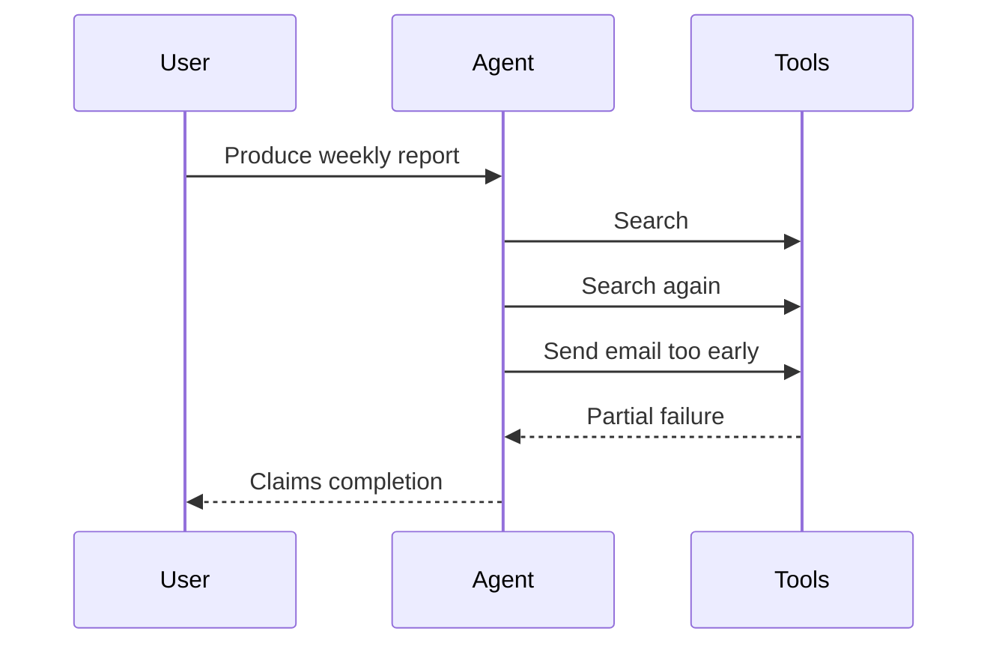

# Agent Architectures - Junior

## Workflow or agent?

A **workflow** follows paths defined in code. An **agent** lets a model choose
the next step. Workflows are cheaper, easier to test, and easier to audit;
agents help when the required path cannot be known in advance.

Common starting patterns:

- **Prompt chain**: fixed sequence such as extract, classify, then draft.
- **RAG pipeline**: retrieve relevant evidence, then generate from it.
- **Router**: classify a request and select one specialized workflow.
- **ReAct loop**: alternate model decisions, actions, and observations.

"Chain of thought" is a prompting behavior, not a complete runtime
architecture. Applications should request concise answers or verifiable work
artifacts rather than depend on exposing private internal reasoning.

## Naive architecture: one autonomous loop for everything

The loop has no explicit stages, acceptance criteria, or approval point. A
better design makes predictable phases deterministic: retrieve inputs,
generate a draft, validate required sections, ask for approval, then send.

## Choose by uncertainty

| Task | Suitable architecture |
|---|---|
| Transform known input to known output | One call or prompt chain |
| Answer from private documents | RAG pipeline |
| Select one of several known handlers | Router |
| Investigate with unknown number of searches | Bounded ReAct loop |

## Test yourself

1. What decision separates a workflow from an agent?
2. Why is a fixed prompt chain easier to test than a ReAct loop?
3. Sketch a RAG pipeline in four steps.
4. Which report stages should remain deterministic in the example above?

Continue to [`middle.md`](middle.md).
