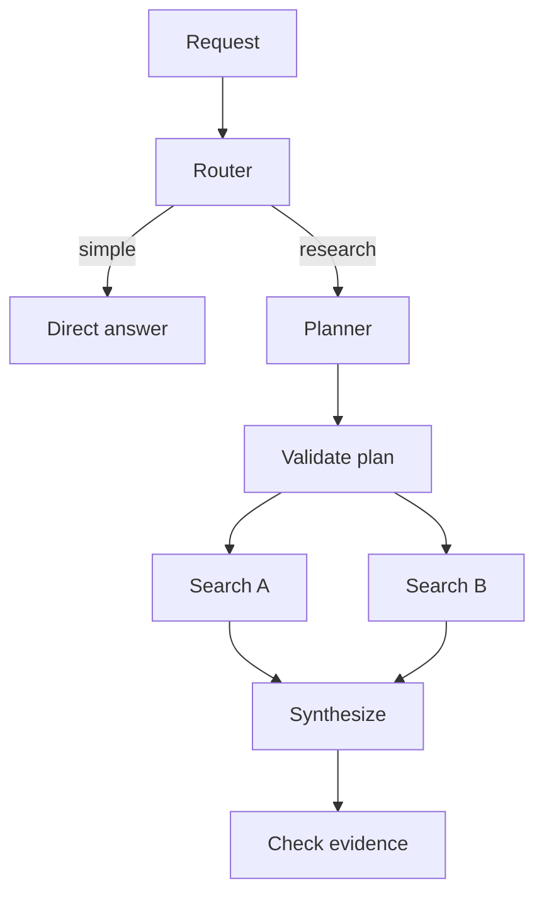

# Agent Architectures - Middle

## Compose control-flow patterns

Real systems combine patterns rather than selecting one label. A router may
choose a workflow; one workflow may ask a planner to construct a DAG; one DAG
node may use retrieval.



## Planner/executor example

```python
class Step(BaseModel):
    id: str
    action: Literal["search", "read", "summarize"]
    depends_on: list[str]
    query: str

def run(task: str):
    plan = validate_dag(model.plan(task, schema=list[Step]))
    state = {}
    for batch in topological_batches(plan):
        for step, result in execute_bounded(batch, state):
            state[step.id] = result
    return verify_and_synthesize(task, state)
```

The model proposes a plan, but code validates allowed actions, missing
dependencies, cycles, maximum nodes, and total budget. Independent nodes may
run in parallel; dependent nodes wait for successful prerequisites.

## Pattern decisions

| Pattern | Strength | Main risk |
|---|---|---|
| Router | Cheap specialization | Misrouting |
| ReAct | Adapts after each observation | Loops and unpredictable cost |
| Planner/executor | Separates strategy from action | Invalid or stale plan |
| DAG | Parallelism and explicit dependencies | Hard to change after execution starts |
| Tree search | Explores alternatives | Branch explosion |

Tree-of-thought-style search should score and prune candidates aggressively;
otherwise cost grows exponentially. Often sampling three independent answers
and selecting with a verifier is simpler than maintaining a deep tree.

## Test yourself

1. Which plan properties must deterministic code validate?
2. When may DAG nodes run concurrently?
3. Why can a valid plan become stale during execution?
4. What simpler alternative can replace a deep reasoning tree?

Continue to [`senior.md`](senior.md).
