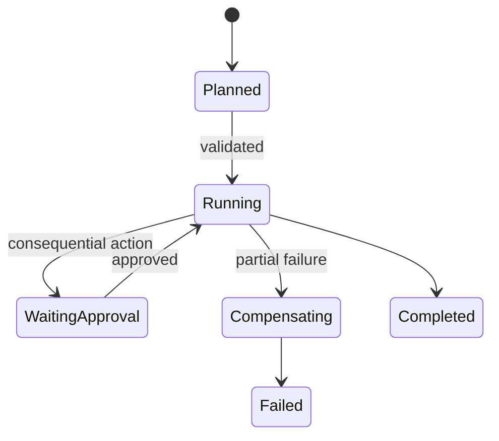

# Agent Architectures - Senior

## Put reliability boundaries between decisions and effects

Model decisions are nondeterministic; state transitions and side effects must
be deterministic, authorized, and replay-safe. Persist the accepted plan and
each step transition before executing consequential work.

## Failure modes by architecture

| Architecture | Failure | Control |
|---|---|---|
| Router | Wrong specialist confidently answers | Confidence threshold and fallback |
| ReAct | Repeated low-value calls | Progress detector, step and cost budgets |
| Planner/executor | Executor changes world and re-plan ignores it | Durable state, idempotency, reconciliation |
| DAG | One critical node fails after siblings commit | Compensation or explicit partial result |
| Multi-agent | Agents amplify the same false assumption | Independent evidence and bounded communication |

Do not retry the whole graph after a late failure. Resume from durable state
and retry only safe nodes. A step is complete when its durable effect is
confirmed, not merely when a worker returned success.

## Architecture evaluation

Evaluate route accuracy, plan validity, step success, evidence coverage,
completion correctness, cost, latency, and human intervention separately.
End-to-end success alone cannot reveal whether a router, planner, tool, or
verifier is causing regressions.

Set budgets for model calls, tokens, wall time, tool calls, branches, and side
effects. Budget exhaustion is a first-class terminal state with a truthful
partial result. Escalate rather than improvising when authority or evidence
is insufficient.

## Test yourself

1. Why must a plan be persisted before consequential execution?
2. What is the difference between worker success and durable completion?
3. Design compensation for a workflow that reserves stock then charges a card.
4. Which metrics isolate planner quality from executor reliability?

Continue to [`professional.md`](professional.md).
