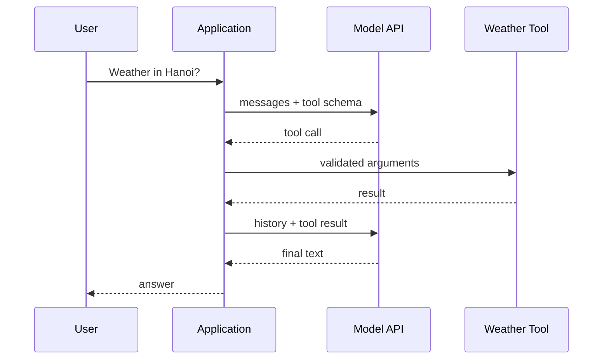

# Building Agents - Junior

## Build one complete vertical slice

Start with one model, one read-only tool, one user request, and one loop. The
application owns tool execution and message history; the model only proposes
calls or returns text.

```python
def run_agent(user_text: str) -> str:
    messages = [{"role": "user", "content": user_text}]
    for _ in range(5):
        response = call_model(messages, tools=[weather_schema])
        messages.append(response.assistant_message)

        if not response.tool_calls:
            return response.text

        results = []
        for call in response.tool_calls:
            results.append(execute_and_format(call))
        messages.append(format_tool_results(results))

    return "Unable to finish within the step limit."
```

Provider SDKs represent messages and tool calls differently, but the control
flow stays the same. Keep the first version explicit so you can inspect each
request and response.

## Trace the loop before adding features



Log correlation IDs, stop reason, selected tool, validation outcome, latency,
and token usage. Redact secrets and private arguments. Never log API keys or
raw sensitive content by default.

## First error handling

- Validate tool arguments before execution.
- Set a maximum number of model turns.
- Return tool failures as structured observations.
- Retry only transient API errors and respect server retry hints.
- Preserve a truthful failure when the task cannot complete.

## Test yourself

1. Which component executes tools and stores message history?
2. What ends the loop in the example?
3. Which fields belong in a safe development trace?
4. Why should validation errors be returned to the model?

Continue to [`middle.md`](middle.md).
