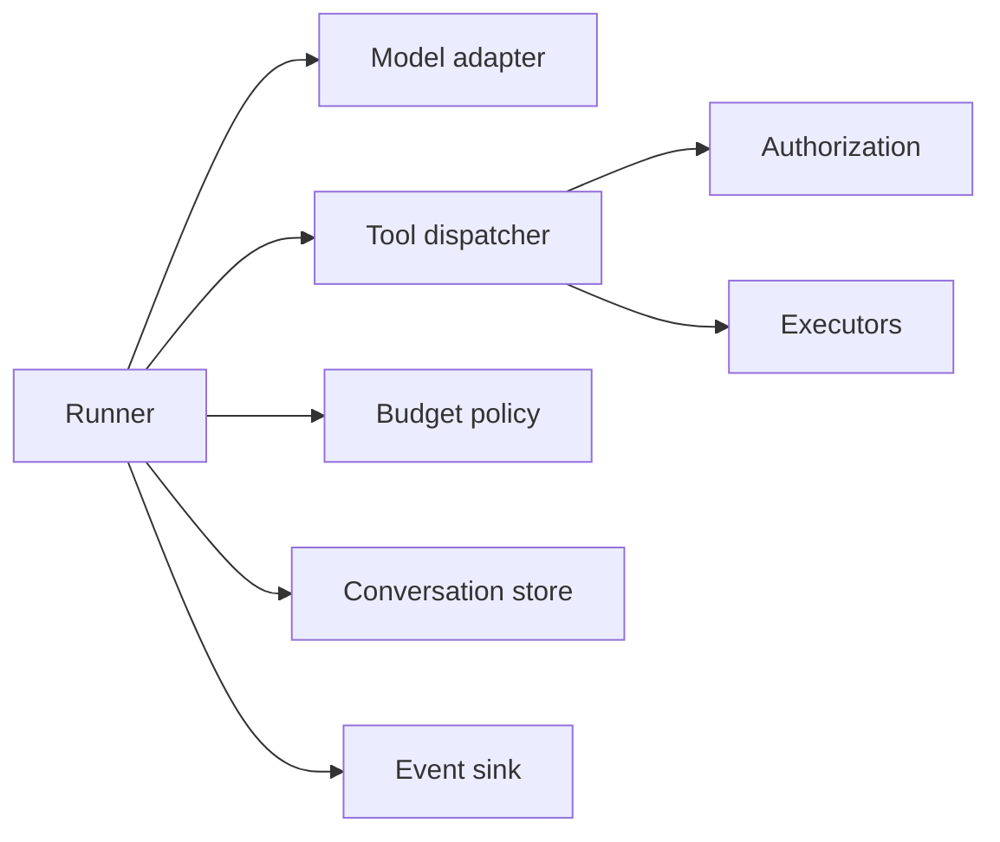

# Building Agents - Middle

## Normalize providers at the boundary

Anthropic tool-use blocks, OpenAI function calls, and Gemini function calls
have different wire shapes. Convert them into a small internal event model;
keep provider-specific code out of tools and business policy.

```python
@dataclass
class ToolCall:
    id: str
    name: str
    arguments: dict

@dataclass
class ModelTurn:
    text: str
    calls: list[ToolCall]
    usage: TokenUsage
    raw_stop_reason: str

class ModelAdapter(Protocol):
    async def complete(self, state: Conversation, tools: list[ToolSpec]) -> ModelTurn: ...
```

Retain raw provider payloads in a redacted debug store when needed, but make
application decisions from normalized typed events. Do not force every
provider feature into a lowest-common-denominator abstraction; expose an
explicit capability flag when a feature is genuinely provider-specific.

## Component boundaries



## Framework or direct SDK?

| Choice | Use when | Cost |
|---|---|---|
| Direct SDK | Small loop, full control, provider-specific feature | More plumbing |
| LangGraph | Stateful graph, checkpoints, interrupts | New execution model |
| LlamaIndex / Haystack | Retrieval-heavy application | Framework-specific data abstractions |
| AutoGen / CrewAI | Experimenting with multi-agent collaboration | More nondeterminism and harder tracing |

Evaluate a framework against requirements: persistence, streaming, human
approval, retries, provider support, tracing, testability, and escape hatches.
Do not choose one because a ten-line demo looks shorter.

## Handle limits correctly

Use exponential backoff with jitter for transient rate limits, bound total
attempts by the request deadline, and honor provider headers where available.
Queue and shed load rather than letting every request retry simultaneously.

## Test yourself

1. Why normalize provider wire formats?
2. When should an adapter expose a provider-specific capability?
3. Which requirement would justify LangGraph over a raw loop?
4. Why must retries share the original request deadline?

Continue to [`senior.md`](senior.md).
