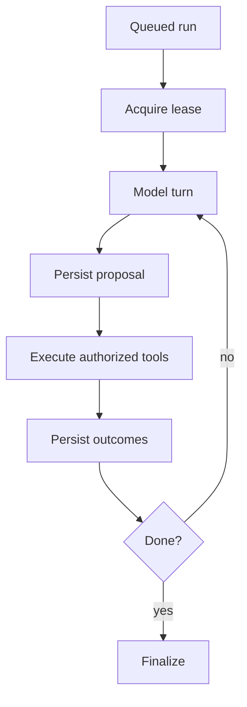

# Building Agents - Senior

## Make execution resumable and replay-safe

Persist state after each accepted model turn and tool result. A process crash
must resume from a durable checkpoint without repeating a committed side
effect. Store immutable events plus a current-state projection when audit and
recovery matter.

## Production controls

| Concern | Required control |
|---|---|
| Duplicate delivery | Run ID, step ID, and tool idempotency key |
| Process loss | Durable state and leased workers |
| Provider outage | Deadline, circuit breaker, optional tested fallback |
| Runaway cost | Per-run token, turn, tool, and dollar budgets |
| Context overflow | Token accounting, compaction, artifact references |
| Unsafe action | Deterministic policy and human approval |

Provider fallback is not a simple hostname change. Models differ in tool
schema support, instruction behavior, context limits, tokenization, and safety
responses. Qualify each model/prompt/tool combination with the same evaluation
suite before routing production traffic.

## Deployment and testing

Separate interactive request handling from long-running workers. Stream
durable progress events to clients; do not require one HTTP connection to stay
alive for the whole run. Propagate cancellation, but reconcile remote actions
that may have committed before cancellation arrived.

Test with fake model adapters and deterministic scripted turns for state
transitions. Add contract tests against provider sandboxes, fault injection
for timeouts and malformed tool calls, and end-to-end evaluation for behavior.
Unit tests alone cannot establish agent quality.

## Test yourself

1. Where should the runtime checkpoint relative to a side effect?
2. Why is provider fallback behaviorally risky?
3. How should a client observe a ten-minute agent run?
4. Which tests should use a fake model and which require a real provider?

Continue to [`professional.md`](professional.md).
