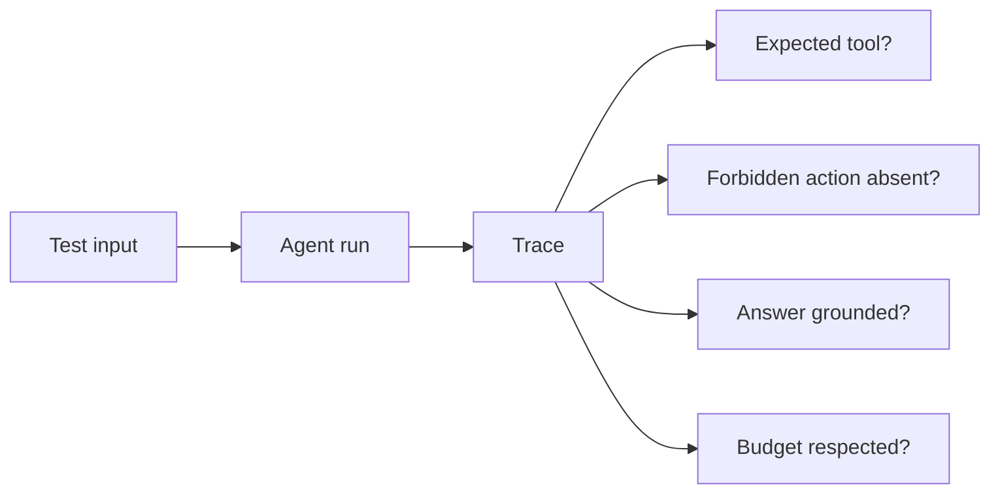

# Evaluation and Testing - Junior

## Test deterministic code first

Agent systems contain ordinary software and probabilistic model behavior. Use
ordinary assertions for schemas, authorization, tool dispatch, calculations,
and state transitions. Do not ask another model to judge whether `2 + 2 == 4`.

```python
def test_refund_tool_rejects_negative_amount():
    result = dispatch("refund", {"order_id": "ord_7", "amount": -1})
    assert result["ok"] is False
    assert result["code"] == "invalid_arguments"

def test_agent_stops_after_budget(fake_model):
    fake_model.always_calls("search", {"query": "same"})
    result = run_agent(fake_model, max_steps=3)
    assert result.status == "budget_exhausted"
    assert fake_model.calls == 3
```

Fake model turns make control-flow tests fast and repeatable. Real model calls
belong in behavioral evaluation, where outputs may vary while still being
acceptable.

## Build scenarios, not trivia



A scenario should include input, setup data, expected properties, forbidden
behavior, and relevant metadata. Include normal, edge, malformed, ambiguous,
and adversarial cases. Ten varied cases are more useful than one hundred
near-duplicates.

## Useful beginner metrics

- Task success rate.
- Correct tool selection and argument validity.
- Forbidden-action rate.
- Turns, tool calls, latency, and token cost per task.
- Human acceptance or correction rate.

An average can hide failure. Group results by scenario type, language, input
length, customer tier, or any dimension that changes difficulty or impact.

## Test yourself

1. Which agent components should use deterministic unit tests?
2. Why use a fake model for loop-state testing?
3. What fields make a scenario reproducible?
4. Why is average task success insufficient?

Continue to [`middle.md`](middle.md).
