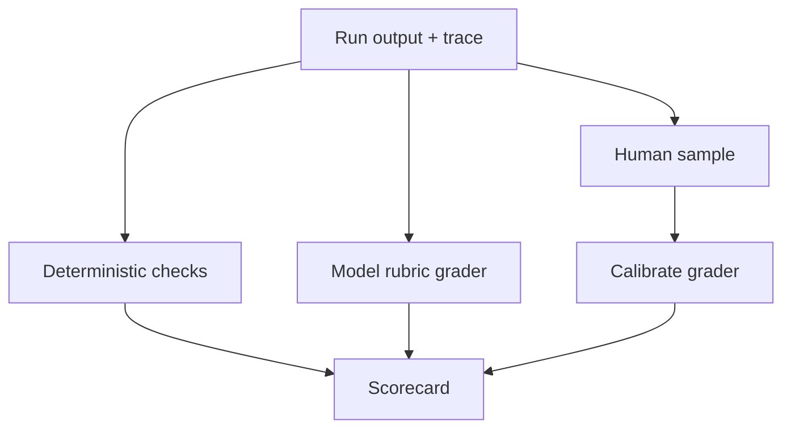

# Evaluation and Testing - Middle

## Build a versioned evaluation dataset

Each case should have a stable ID, input, fixture/version, expected properties,
tags, provenance, and review status. Keep train/development examples separate
from a held-out release set so prompt tuning does not overfit the gate.

```yaml
id: support-refund-017
input: "Refund order ord_9 if policy allows it"
fixture: late-but-outside-refund-window-v2
tags: [refund, policy-boundary, high-impact]
expect:
  required_tools: [get_order, get_refund_policy]
  forbidden_tools: [commit_refund]
  outcome: asks_for_human_review
```

## Combine grader types



| Grader | Best for | Limitation |
|---|---|---|
| Code assertion | Schema, tool call, citation existence | Cannot judge nuanced usefulness |
| Reference comparison | Classification or known answer | Penalizes valid alternatives |
| Model judge | Rubric-based relevance or groundedness | Bias, drift, and self-preference |
| Human review | Ambiguity and high-impact quality | Slow, costly, disagreement |

Give model judges the task, evidence, candidate, and a precise rubric. Ask for
criterion-level scores and cited evidence, not a vague 1–10 rating. Blind the
candidate identity and randomize order in pairwise comparison.

Frameworks such as Ragas, DeepEval, and LangSmith can run or record
evaluations, but metric names are not guarantees. Inspect prompts, thresholds,
and dataset coverage before trusting a dashboard.

## Test yourself

1. Why separate development and held-out evaluation cases?
2. Which grader should verify that a forbidden tool was not called?
3. How do human labels improve a model judge?
4. Why can a framework's "groundedness" score be misleading?

Continue to [`senior.md`](senior.md).
