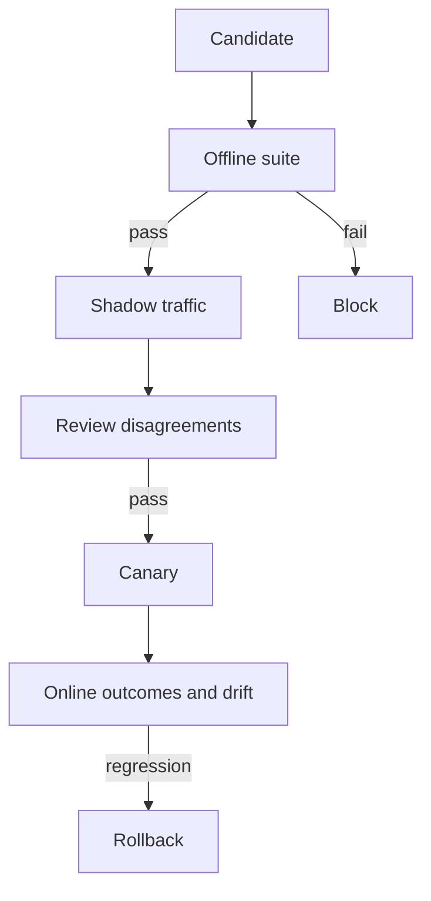

# Evaluation and Testing - Senior

## Turn evaluation into a release gate

Compare every candidate against the deployed baseline using the same cases,
fixtures, concurrency, and grader versions. Require non-regression globally
and on critical slices; safety invariants are hard gates, not averages that
can be offset by better prose.

## Common evaluation failures

| Failure | Consequence | Control |
|---|---|---|
| Dataset contamination | Inflated scores | Provenance and held-out sets |
| Judge agrees with itself | Biased comparison | Different judge family plus humans |
| Aggregate-only reporting | Minority or safety regression hidden | Predeclared slices and invariants |
| Flaky tools/data | Candidate blamed for fixture noise | Hermetic fixtures and repeated trials |
| Optimizing one score | Goodhart's law | Multi-metric scorecard and review |
| Production drift | Offline suite becomes stale | Sample failures and refresh deliberately |

## Account for nondeterminism

Run important cases multiple times and report pass probability, variance, and
worst-case behavior. Pair candidate and baseline runs where possible to reduce
noise. Do not interpret a one-point gain on twenty examples as proof.

Define budgets for quality, safety, latency, and cost. For example: no critical
policy violation; lower confidence bound for task success does not regress by
more than 2%; p95 latency remains under the product SLO; median cost grows less
than 10% unless quality gain is approved.

Human review needs written rubrics, blinded ordering, calibration examples,
and inter-rater agreement tracking. Disagreement is useful evidence that the
task or rubric may be underspecified.

## Test yourself

1. Which properties should be hard gates rather than averaged scores?
2. How does paired candidate/baseline execution reduce noise?
3. Why should high-value cases run multiple times?
4. What does low reviewer agreement tell you?

Continue to [`professional.md`](professional.md).
