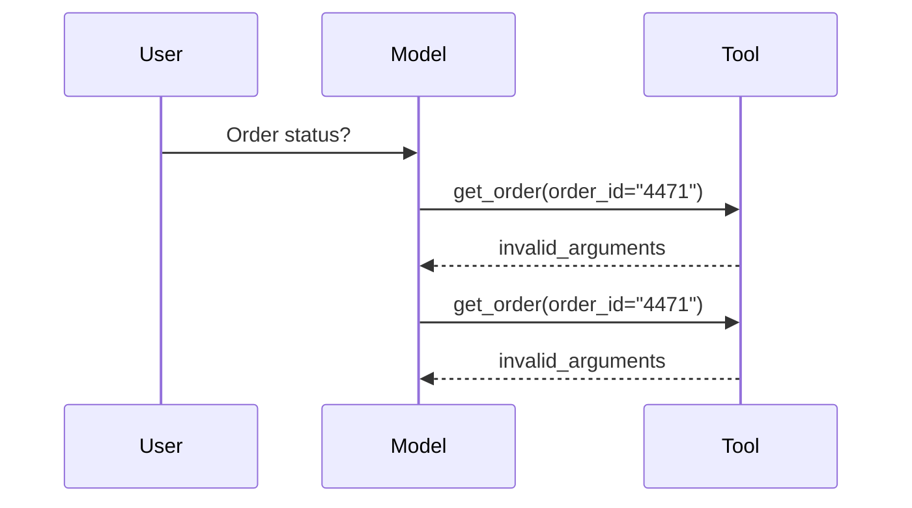

# Debugging and Monitoring - Junior

## Follow one run end to end

Printing the final answer cannot explain why an agent failed. Give every run a
correlation ID and record one structured event for each important transition.

```json
{
  "run_id": "run_82",
  "step": 2,
  "event": "tool.completed",
  "tool": "get_order",
  "duration_ms": 143,
  "outcome": "timeout",
  "retryable": true
}
```

Useful fields include run and step IDs, prompt/model/tool versions, stop
reason, latency, token usage, validation result, retry count, and terminal
status. Never put secrets or raw private data into logs by default.

## Debug by locating the first bad transition



The final symptom is "agent loops." The first bad transition is that the model
repeats an invalid argument. Inspect whether the schema example, validation
message, or loop progress detector failed before changing the whole prompt.

## Logs, metrics, and traces

- **Log**: detailed event for investigation.
- **Metric**: aggregated number for trends and alerts.
- **Trace**: causally linked spans for one request.

Use metrics to notice rising tool errors, traces to identify the responsible
step, and logs for detailed local evidence.

## Test yourself

1. Which fields let you reconstruct one run?
2. What is the first bad transition in the diagram?
3. When would you use a metric instead of a log?
4. Why should raw prompts not be logged by default?

Continue to [`middle.md`](middle.md).
