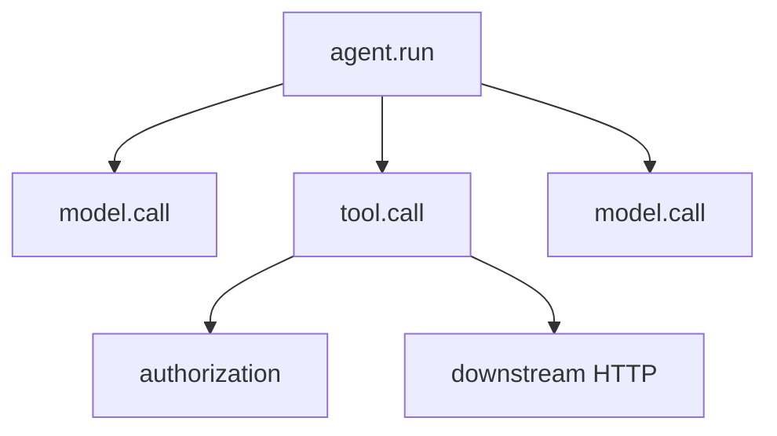

# Debugging and Monitoring - Middle

## Model the run as nested spans

Create a root span for the run and child spans for model calls, retrieval,
tools, policy checks, checkpoints, and human waits. Propagate trace context
across queues and HTTP calls so asynchronous work remains connected.



```python
with tracer.start_as_current_span("tool.call") as span:
    span.set_attribute("tool.name", call.name)
    span.set_attribute("tool.call_id", call.id)
    span.set_attribute("arguments.hash", safe_hash(call.arguments))
    result = dispatcher.execute(call)
    span.set_attribute("tool.outcome", result.code)
```

Do not use user ID, prompt text, URL, or run ID as metric labels; their high
cardinality can overwhelm the metrics backend. Keep correlation IDs in traces
and logs.

## Diagnose by layer

| Symptom | Inspect first |
|---|---|
| Slow first token | Queueing, model prefill, provider latency |
| Repeated tool | Tool result, progress detection, prompt/tool description |
| Wrong answer with good evidence | Context assembly and model turn |
| Missing evidence | Retrieval query, filters, index freshness |
| Claimed action absent | Tool outcome, idempotency record, final synthesis |

LangSmith, Langfuse, Helicone, and OpenLLMetry can capture overlapping parts
of this data. Choose based on exportability, redaction, self-hosting, sampling,
evaluation linkage, and support for your runtime. Preserve vendor-neutral
trace IDs and an export path.

## Test yourself

1. Why propagate trace context through a queue?
2. Which values cause dangerous metric cardinality?
3. What would you inspect for a correct retrieval result but wrong answer?
4. Which criteria matter when selecting an observability product?

Continue to [`senior.md`](senior.md).
