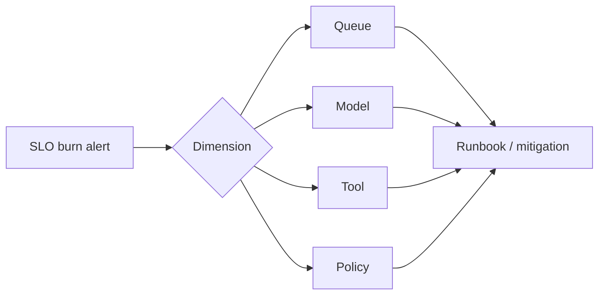

# Debugging and Monitoring - Senior

## Monitor user outcomes and system mechanics

Availability alone is insufficient: an agent can return HTTP 200 while taking
the wrong action. Define SLOs for terminal success, critical policy safety,
latency, and cost, then use mechanism metrics to diagnose violations.

## Alert design

| Signal | Alert when | Avoid |
|---|---|---|
| Completion SLO | Fast/slow burn exceeds budget | Paging on one failure |
| Tool errors | Sustained by tool and error class | One alert per tenant |
| Stuck runs | Age exceeds workflow deadline | Counting approved human waits |
| Cost | Sudden tokens/run or retries/run shift | Static spend threshold only |
| Safety | Any confirmed critical violation | Averaging it with quality |

Tie every page to an owner, impact statement, dashboard, first diagnostic
queries, mitigation, rollback, and escalation. If no immediate action exists,
the signal likely belongs in a ticket or report rather than a page.

## Privacy-aware debugging

Use layered capture: metadata for all runs, redacted structures for sampled
runs, and encrypted content access only for approved investigations with an
audit trail and retention limit. Scrub secrets before telemetry leaves the
process; downstream redaction is too late.

During rollout, compare candidate and baseline by prompt/model/runtime version.
Monitor slices and trace exemplars, not only fleet averages. Roll back on
safety violations or sustained SLO burn, even if an offline quality score rose.

## Test yourself

1. Why can an HTTP availability SLO hide agent failure?
2. Which safety signal should page without waiting for an average?
3. What must every actionable runbook contain?
4. Why should redaction happen before export?

Continue to [`professional.md`](professional.md).
