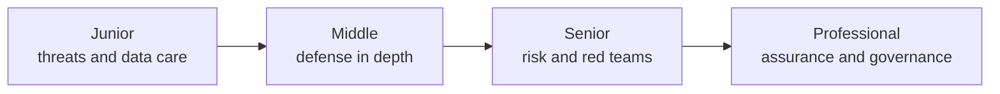
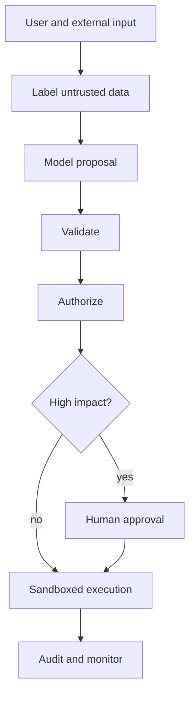

# Security and Ethics

> Safe agents combine model guidance with deterministic capability control, privacy engineering, and accountable human decisions.

## Levels

| Level | Guide | You are done when... |
|---|---|---|
| Junior | [junior.md](junior.md) | You can identify injection, excessive agency, privacy, bias, and harmful-output risks |
| Middle | [middle.md](middle.md) | You can apply least privilege, validation, sandboxing, redaction, and approval controls |
| Senior | [senior.md](senior.md) | You can threat-model an agent and run risk-based safety evaluations and red teams |
| Professional | [professional.md](professional.md) | You can build an auditable assurance program across models, data, tools, and people |

## Practice rule

Assume model output and retrieved content are untrusted. No prompt can replace authorization, isolation, or informed human oversight.

## Related

- [Tools and Actions](../05-tools-actions/)
- [Agent Memory](../07-agent-memory/)
- [Evaluation and Testing](../10-evaluation-and-testing/)
- [Debugging and Monitoring](../11-debugging-and-monitoring/)
