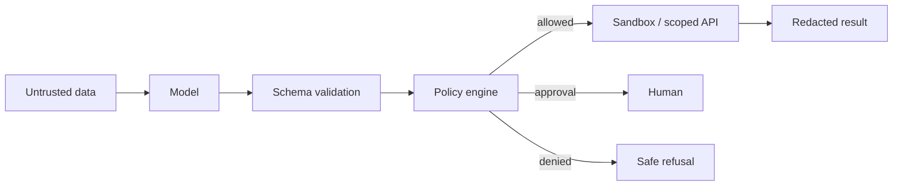

# Security and Ethics - Middle

## Apply defense in depth

Security controls should surround the model rather than depend on it.

## Control map

| Risk | Control |
|---|---|
| Injection | Separate instructions/data; restrict downstream capabilities |
| Tool abuse | Narrow schemas, allow-lists, authorization, idempotency |
| Code escape | Isolated runtime, no ambient secrets, CPU/memory/network limits |
| PII leakage | Minimize, classify, redact, encrypt, retain briefly |
| Toxicity | Input/output policy checks plus contextual human escalation |
| Bias | Representative slices, outcome analysis, appeal and correction |

PII redaction needs structured detectors and context, not one regular
expression. Preserve placeholders consistently when the task requires entity
relationships, and test false positives that might erase necessary evidence.

## Threat-model one feature

For an email assistant, list assets (mailbox, contacts, credentials), actors
(user, attacker, third-party sender), trust boundaries (retrieved mail, model,
email API), and abuse cases (data exfiltration, spoofed approval, mass send).
Then map a preventive and detective control to each high-risk path.

Safety classifiers can reduce exposure but have false positives, false
negatives, language gaps, and adversarial weaknesses. Version them, evaluate
by risk slice, and provide a path for legitimate users to recover from errors.

## Test yourself

1. Which control prevents a model from authorizing itself?
2. Why is regex-only PII redaction inadequate?
3. Identify assets and trust boundaries for a database assistant.
4. Why does a toxicity classifier need an appeal path?

Continue to [`senior.md`](senior.md).
