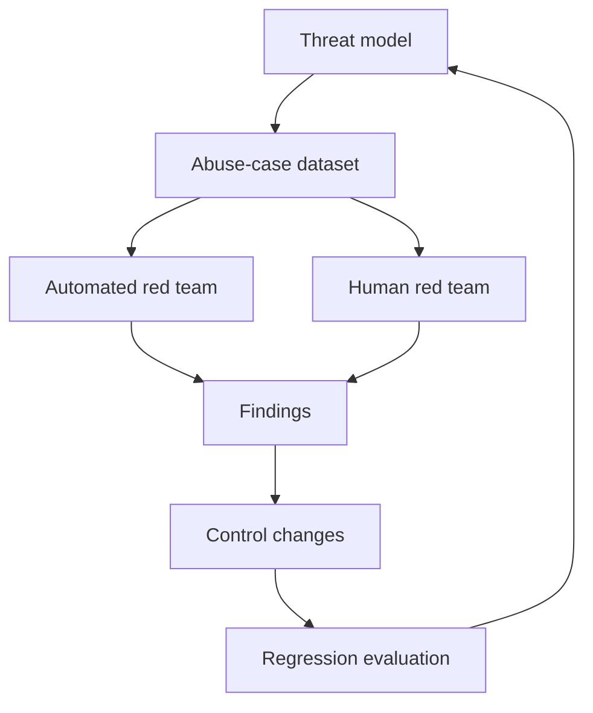

# Security and Ethics - Senior

## Make risk explicit

Assess severity, likelihood, exposure, affected population, reversibility, and
detectability for each harm. Risk acceptance belongs to an accountable owner,
not an implicit model or engineering default.

## Senior failure modes

| Failure | Control |
|---|---|
| Approval fatigue | Risk-tier actions; batch clear previews; expire approvals |
| Rubber-stamp human review | Give evidence, alternatives, time, and authority to reject |
| Red-team overfitting | Hold out attack families and rotate independent testers |
| Safety-quality trade hidden | Report utility and harm by slice |
| Vendor/model change | Re-run threat-focused gates before rollout |
| Incident evidence leaks data | Restricted, redacted forensic workflow |

Red teams should test objective compromise, data exfiltration, cross-tenant
access, privilege escalation, tool chaining, encoding/obfuscation, multilingual
attacks, denial of wallet, and recovery after partial effects. Findings need
reproducible traces, impact, affected versions, and a regression case.

## Meaningful human oversight

A reviewer must understand the proposed action, evidence, uncertainty, and
consequence; be able to modify or reject it; and not be pressured by impossible
throughput targets. Measure override quality and downstream outcomes, not just
approval speed.

Maintain a data inventory and model/tool supply-chain inventory. Pin versions,
verify artifacts, review licenses and data terms, and define emergency disable
paths for models, tools, tenants, and action classes.

## Test yourself

1. Which dimensions belong in a harm-risk assessment?
2. How do you prevent red-team benchmark overfitting?
3. What makes human oversight meaningful rather than ceremonial?
4. Which emergency controls should a high-impact agent expose?

Continue to [`professional.md`](professional.md).
