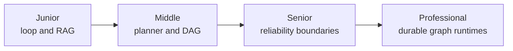
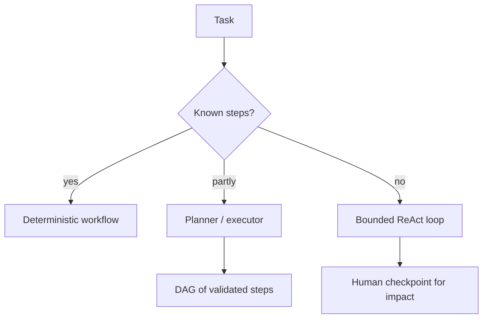

# Agent Architectures

> Architecture decides which choices belong to deterministic code and which, if any, belong to a model.

## Levels

| Level | Guide | You are done when... |
|---|---|---|
| Junior | [junior.md](junior.md) | You can distinguish a workflow, RAG pipeline, and ReAct-style agent |
| Middle | [middle.md](middle.md) | You can choose among routing, planner/executor, DAG, and iterative search |
| Senior | [senior.md](senior.md) | You can bound autonomy and recover safely from partial execution |
| Professional | [professional.md](professional.md) | You can design a durable, observable graph runtime for agentic work |

## Practice rule

Use the least autonomous architecture that solves the task. Predictable steps belong in code, not in repeated model decisions.

## Related

- [AI Agents 101](../ai-agents-101/)
- [Agent Memory](../agent-memory/)
- [Building Agents](../building-agents/)
- [Evaluation and Testing](../evaluation-and-testing/)
