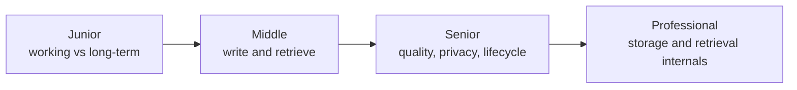
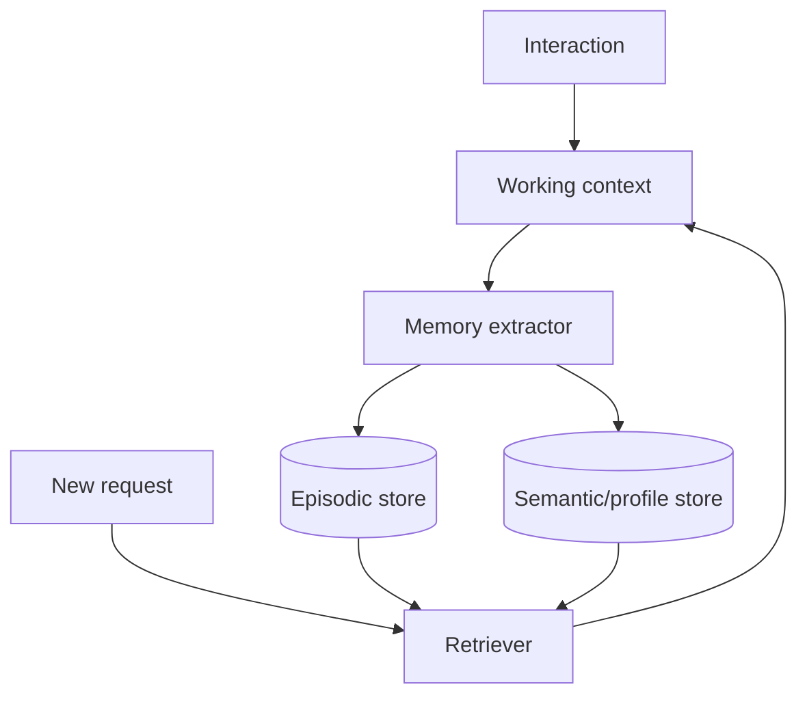

# Agent Memory

> Agent memory is selective state: what to retain, retrieve, update, and deliberately forget.

## Levels

| Level | Guide | You are done when... |
|---|---|---|
| Junior | [junior.md](junior.md) | You can distinguish context history, episodic memory, and semantic memory |
| Middle | [middle.md](middle.md) | You can implement explicit memory writes and relevance-based retrieval |
| Senior | [senior.md](senior.md) | You can prevent stale, poisoned, private, or contradictory memories from driving behavior |
| Professional | [professional.md](professional.md) | You can design memory storage, indexing, lifecycle, and operations at scale |

## Practice rule

Do not store every message. Define why each memory will help a future decision, who owns it, and when it expires.

## Related

- [AI Agents 101](../ai-agents-101/)
- [Agent Architectures](../agent-architectures/)
- [Evaluation and Testing](../evaluation-and-testing/)
- [Security and Ethics](../security-ethics/)
