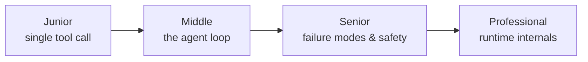
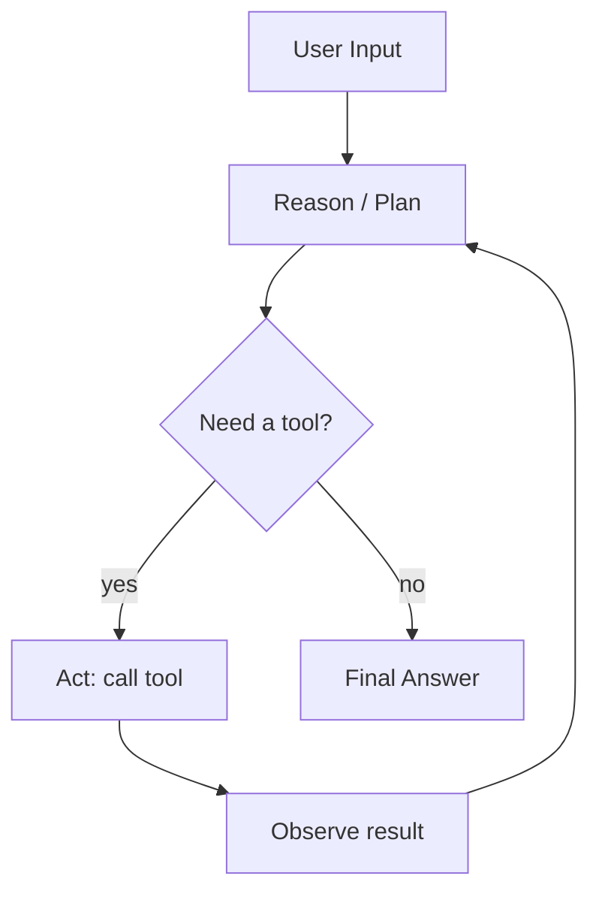

# AI Agents 101

> An agent is an LLM given a loop, a toolbox, and permission to decide what happens next.

## Levels

| Level | Guide | You are done when... |
|---|---|---|
| Junior | [junior.md](junior.md) | You can explain why a single LLM call can't finish a multi-step task, and trace one full perceive→act→observe cycle by hand |
| Middle | [middle.md](middle.md) | You've implemented a working agent loop with a stop condition and at least one real tool |
| Senior | [senior.md](senior.md) | You can list 3 ways an agent loop fails in production and the guardrail for each |
| Professional | [professional.md](professional.md) | You can explain how a real agent runtime (e.g. Claude Code, a LangGraph executor) manages context, tool dispatch, and cancellation under the hood |

## Practice rule

Before reading about a framework, build one agent loop by hand with raw API calls. If you can't write the `while` loop yourself, the framework is hiding the part you need to understand.

## Related

- [Prompt Engineering](../prompt-engineering/) — writing the instructions the agent reasons over
- [Tools / Actions](../tools-actions/) — the actions side of the loop
- [Agent Memory](../agent-memory/) — what persists across loop iterations
- [Agent Architectures](../agent-architectures/) — named patterns built on this loop
