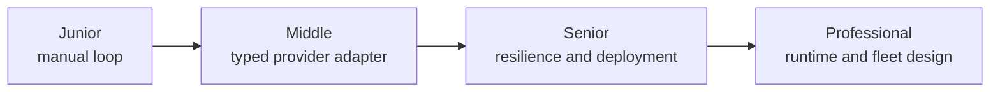
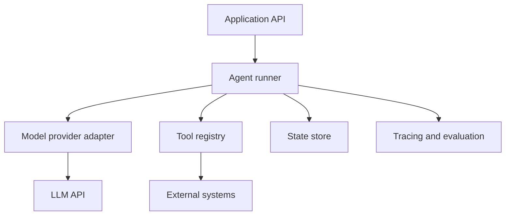

# Building Agents

> Build the smallest complete loop first; add frameworks only for complexity you can name.

## Levels

| Level | Guide | You are done when... |
|---|---|---|
| Junior | [junior.md](junior.md) | You can implement and trace a small tool-using loop with raw SDK calls |
| Middle | [middle.md](middle.md) | You can separate provider events, tool execution, and application state |
| Senior | [senior.md](senior.md) | You can deploy with retries, idempotency, budgets, persistence, and observability |
| Professional | [professional.md](professional.md) | You can design a provider-neutral runtime and operate it across a fleet |

## Practice rule

Keep one golden end-to-end trace for the raw SDK implementation. Use it to verify every abstraction or framework migration.

## Related

- [AI Agents 101](../ai-agents-101/)
- [Tools and Actions](../tools-actions/)
- [Agent Architectures](../agent-architectures/)
- [Evaluation and Testing](../evaluation-and-testing/)
