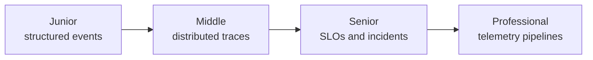
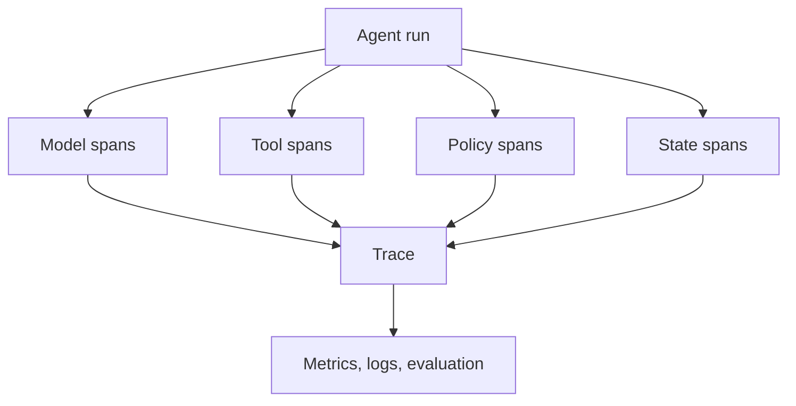

# Debugging and Monitoring

> Debug an agent as a trace of decisions and effects, not as one final string.

## Levels

| Level | Guide | You are done when... |
|---|---|---|
| Junior | [junior.md](junior.md) | You can reconstruct a failed run from correlated structured events |
| Middle | [middle.md](middle.md) | You can instrument model, tool, policy, and state spans safely |
| Senior | [senior.md](senior.md) | You can define SLOs, alerts, runbooks, and rollback signals |
| Professional | [professional.md](professional.md) | You can operate high-volume telemetry without leaking data or losing causality |

## Practice rule

Record identifiers, versions, timings, outcomes, and hashes by default; record sensitive content only through explicit, controlled sampling.

## Related

- [Building Agents](../building-agents/)
- [Evaluation and Testing](../evaluation-and-testing/)
- [Security and Ethics](../security-ethics/)
