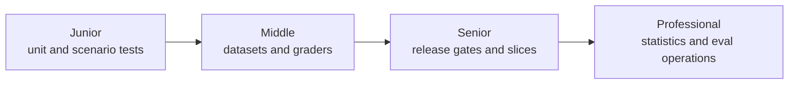
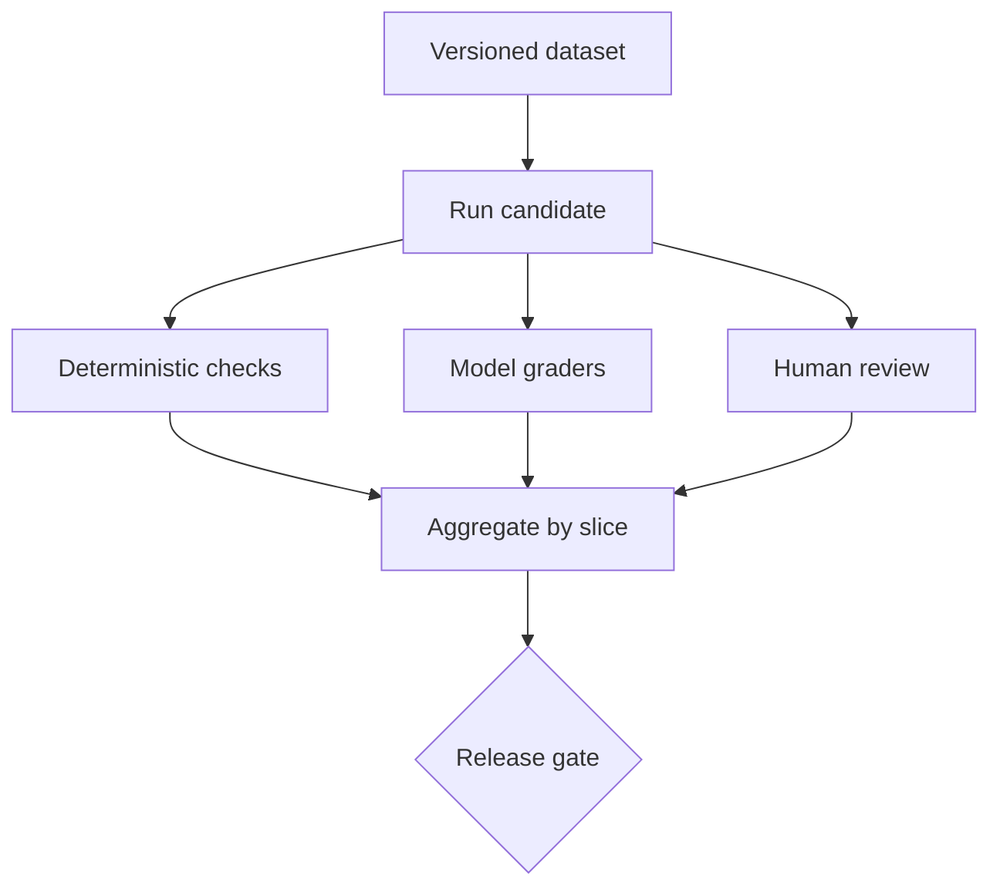

# Evaluation and Testing

> Agent quality is a distribution measured across tasks, traces, failures, and human judgments, not one impressive demo.

## Levels

| Level | Guide | You are done when... |
|---|---|---|
| Junior | [junior.md](junior.md) | You can test tools deterministically and write representative agent scenarios |
| Middle | [middle.md](middle.md) | You can build a versioned dataset and combine code, model, and human graders |
| Senior | [senior.md](senior.md) | You can gate releases on slices, safety, cost, latency, and regression evidence |
| Professional | [professional.md](professional.md) | You can operate statistically credible evaluations and detect evaluation-system failures |

## Practice rule

Every production failure should become a minimized, privacy-safe regression case with a named expected behavior.

## Related

- [Prompt Engineering](../prompt-engineering/)
- [Building Agents](../building-agents/)
- [Debugging and Monitoring](../debugging-and-monitoring/)
- [Security and Ethics](../security-ethics/)
