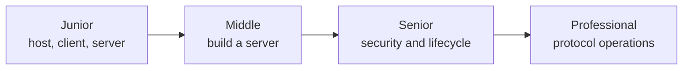
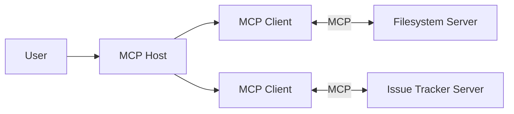

# Model Context Protocol (MCP)

> MCP standardizes how AI hosts discover and use external context and capabilities without hard-coding every integration.

## Levels

| Level | Guide | You are done when... |
|---|---|---|
| Junior | [junior.md](junior.md) | You can distinguish hosts, clients, servers, tools, resources, and prompts |
| Middle | [middle.md](middle.md) | You can build and inspect a small local MCP server |
| Senior | [senior.md](senior.md) | You can choose a transport and secure trust, consent, and lifecycle boundaries |
| Professional | [professional.md](professional.md) | You can operate versioned MCP services with protocol-level observability and isolation |

## Practice rule

Inspect every capability a server advertises before enabling it. Protocol interoperability does not imply trust.

## Related

- [Tools and Actions](../tools-actions/)
- [Agent Memory](../agent-memory/)
- [Building Agents](../building-agents/)
- [Security and Ethics](../security-ethics/)
