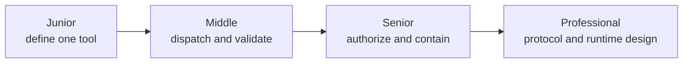
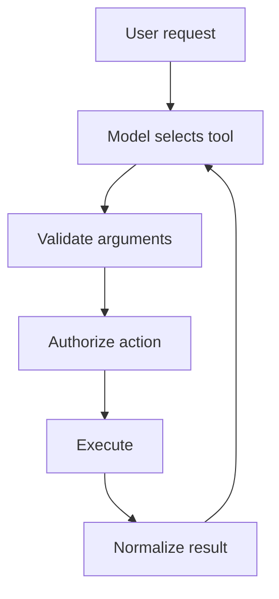

# Tools and Actions

> A tool turns model intent into a real capability, so its contract and guardrails matter more than its description alone.

## Levels

| Level | Guide | You are done when... |
|---|---|---|
| Junior | [junior.md](junior.md) | You can define a narrow tool with a clear schema and truthful errors |
| Middle | [middle.md](middle.md) | You can implement a typed dispatcher that validates inputs and returns normalized results |
| Senior | [senior.md](senior.md) | You can secure side effects with authorization, approval, idempotency, and sandboxing |
| Professional | [professional.md](professional.md) | You can design tool execution as a reliable, observable capability system |

## Practice rule

Begin with the smallest capability. Prefer `read_invoice(id)` over `run_sql(query)` and `create_draft_email` over `send_email`.

## Related

- [AI Agents 101](../ai-agents-101/)
- [Prompt Engineering](../prompt-engineering/)
- [Model Context Protocol](../model-context-protocol-mcp/)
- [Security and Ethics](../security-ethics/)
