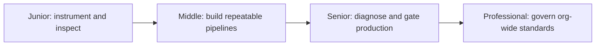

# AI Evaluation

> Know whether an LLM or agentic system actually works — see what it did, catch when a change breaks it, and measure how good it is against a baseline, before and after it ships.

Every topic in this section climbs the same four levels. Junior means you can instrument one call, run one offline check, or write one deterministic test and read the result back. Middle means you can build a pipeline — a golden-set suite, a structured trace across an agent's steps, an LLM-as-judge scorer — that a team relies on. Senior means you can use evidence from that pipeline to diagnose a live production problem and decide what blocks a deploy versus what only gets watched. Professional means you can set standards — schemas, gates, infrastructure — that keep many teams from each re-deriving the same answers badly.

## Topics

| # | Topic | What you'll learn |
|---|-------|-------------------|
| 01 | [Observability](observability/junior.md) | Trace a request through prompt construction, model calls, and tool calls, and capture the cost/latency/quality signals that logs alone don't give you. |
| 02 | [Testing](testing/junior.md) | Catch regressions in non-deterministic prompt and agent logic without asserting exact-match output, and keep those tests fast enough for CI. |
| 03 | [Evaluation](evaluation/junior.md) | Measure how good a system's output is — accuracy, faithfulness, helpfulness, safety — against a baseline, using human judgment, LLM-as-judge, and online signals. |

## How to use this section

Each topic has four depth levels — **junior → middle → senior → professional** — and the three topics build on each other in the order listed. Observability comes first because it's the substrate: you cannot write a meaningful regression test or evaluate quality without first being able to see what the system actually did — which prompt was sent, which tools were called, what the model returned, at what cost. Testing consumes that visibility to answer a narrow question, *did this change break something that used to work* — deterministic where it can be, tolerant of model non-determinism where it can't. Evaluation asks a broader and harder question that testing doesn't answer at all — *how good is this, on which dimensions, compared to what* — and it leans on the same traces and often the same golden sets that observability and testing already produce. A system with good observability but no evaluation can tell you a request cost $0.04 and took 800ms without ever telling you whether the answer was any good. A system with evaluation but no observability can score outputs but can't explain why a specific one failed.

## Practice rule

Before trusting a claim about an LLM or agent system — "it works," "it's better than the old prompt," "the regression is fixed" — name the trace, test, or eval score that is the evidence for that claim. If you can't point to one, you don't know it yet, you believe it.

---

*Part of [Engineer Knowledge](../../README.md) → [AI Engineering](../README.md).*
