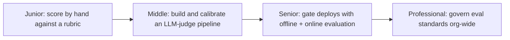
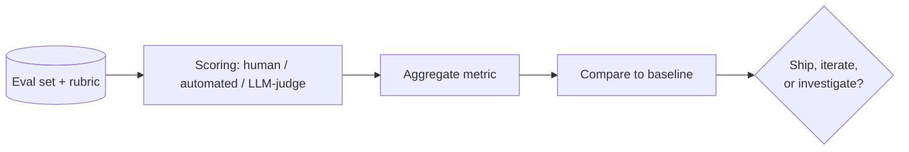

# Evaluation

> Evaluation asks a different question than testing: not "did this break," but "how good is this, on what dimensions, compared to what baseline" — using human judgment, automated checks, and LLM-as-judge, before and after a change ships.

Part of [AI Evaluation](../README.md), alongside [Observability](../observability/README.md) and [Testing](../testing/README.md).

The second diagram is the loop every level in this topic refines: a fixed eval set scored by some method, aggregated, and compared to a baseline — never a bare number reported in isolation. What changes level to level is who or what does the scoring, how much of the loop is automated, and what decision the comparison feeds.

## Levels

| Level | Guide | You are done when... |
|---|---|---|
| Junior | [junior.md](junior.md) | You can score a fixed set of outputs by hand against a concrete rubric, compute a pass rate, and explain why that's a different question than a regression test. |
| Middle | [middle.md](middle.md) | You can build an LLM-as-judge pipeline for one quality dimension and validate its scores against human judgment before trusting it at scale. |
| Senior | [senior.md](senior.md) | You can design an offline-plus-online evaluation strategy, state what gates a deploy versus what's only monitored, and use evidence to resolve a disagreement between the two. |
| Professional | [professional.md](professional.md) | You can run shared eval infrastructure, a documented evidence bar before shipping, and eval-as-code versioning across many teams. |

## Practice rule

Before trusting a quality claim — "this prompt is better," "the new model is more helpful" — name the eval set, the rubric, and the baseline the score was measured against. A score with no stated baseline and no rubric behind it is an opinion wearing a number.

## Related

- [Observability](../observability/README.md) — a judge pipeline needs traces of what the model actually saw (the exact prompt, the retrieved context, the tool calls) to debug a disagreement between a judge score and a human score. See [Observability — Senior](../observability/senior.md) for tracing an agent's full execution path.
- [Testing](../testing/README.md) — easy to conflate with evaluation because both use a set of examples. Testing's golden set checks "did this specific known case break"; evaluation's eval set checks "how good is the system overall, right now, compared to a baseline." See [Testing — Middle](../testing/middle.md) for how a golden-set regression suite is built.
- [RAG Techniques](../../rag/rag-techniques/) — faithfulness/groundedness scoring is most concrete in a RAG system, where the retrieved context is the reference an answer is checked against.
- [Agent Architectures](../../ai-agent/agent-architectures/) — evaluating an agent means evaluating a full trajectory of tool calls and intermediate steps, not just a final response.
