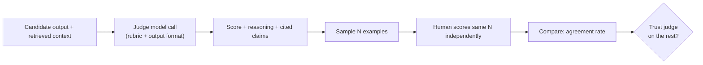

# Evaluation — Middle

<!-- level-focus -->
At middle level, focus on this question:

> Can you build an LLM-as-judge pipeline for one specific quality dimension, and validate it against human judgment on a sample before trusting its scores on the rest?

Use the smallest realistic scenario that exposes the decision and its failure behavior.

Part of [Evaluation](README.md).

---

## Core Concept 1 — Why Manual Scoring Stops Scaling

Hand-scoring 20 outputs against a rubric (junior level) works for a one-off check. It breaks down the moment evaluation needs to run repeatedly: after every prompt edit, on every pull request, against a nightly batch of 500 real production transcripts. At that volume, a human rubric-scorer becomes the bottleneck, and worse, human scoring itself gets less consistent under volume — attention drifts by output 400.

Three ways to automate scoring, in increasing order of how much judgment they can capture:

| Approach | What it checks | Strength | Limit |
|---|---|---|---|
| **Rule-based** | Exact match, regex, JSON schema validity, keyword presence/absence | Fast, deterministic, free | Can't judge meaning — "contains the word 'refund'" isn't "correctly explains the refund policy" |
| **Embedding similarity** | Cosine similarity between the output and a reference answer | Cheap, fast, catches gross semantic drift | A high-similarity answer can still be wrong in a way that matters (a subtly different number, an inverted condition) |
| **LLM-as-judge** | A second model call scores or compares outputs against a rubric or reference, in natural language | Can evaluate nuanced criteria rule-based checks can't (tone, groundedness, helpfulness) | Costs money and latency per evaluation, and inherits its own biases (Core Concept 4) — it is not automatically trustworthy just because it's a model |

None of these replaces human judgment; they approximate it at a cost humans can't match at scale. The rest of this level builds and validates one of them.

## Core Concept 2 — Pick One Dimension, Not Everything at Once

Trying to automate every rubric criterion from the junior level at once (groundedness, on-topic, safety, completeness) in a single pass makes the validation step in Core Concept 6 nearly impossible to reason about — if the judge disagrees with a human, which of the four dimensions caused it?

Pick one dimension with a genuine, well-scoped definition. A common and concrete starting point for a RAG-backed system: **faithfulness (groundedness)** — does the answer state only things actually supported by the retrieved context, without adding claims the context doesn't support? This is a good first target because it has a clear, checkable definition (compare each claim in the answer against the retrieved passages) and because getting it wrong has direct product consequences — an ungrounded answer is a fabrication presented with the system's full confidence. [Ragas](https://github.com/explodinggradients/ragas) is a real, purpose-built library for exactly this class of RAG metric (faithfulness, context precision, context recall) if you'd rather adopt an existing implementation than write the judge prompt from scratch — but understanding what it's doing internally is what this level is about.

## Core Concept 3 — Writing a Judge Prompt

A judge prompt needs the same rigor a rubric needed at junior level — vague instructions produce vague, inconsistent scores from a model exactly as they would from a human. Two things a bare "is this answer good? Rate 1–5" judge prompt is missing: a specific definition of the dimension, and a required output format a human can audit.

```text
You are evaluating whether an answer is FAITHFUL to its retrieved context.

Retrieved context:
{context}

Answer to evaluate:
{answer}

Instructions:
1. List every factual claim made in the answer.
2. For each claim, decide whether it is directly supported by the retrieved
   context, contradicted by it, or not mentioned in it at all.
3. Score:
   - 3 = every claim is directly supported
   - 2 = all claims are consistent with the context, but at least one adds
         unsupported specifics (a number, a date, a policy detail not in the context)
   - 1 = at least one claim is contradicted by the context or invented outright

Respond as JSON:
{
  "unsupported_claims": ["<claim text>", ...],
  "contradicted_claims": ["<claim text>", ...],
  "score": <1|2|3>,
  "reasoning": "<one or two sentences citing the specific claim(s) that drove the score>"
}
```

Three deliberate choices here matter more than the wording:

- **The score comes with reasoning and named claims, not just a number.** A bare `score: 2` gives you nothing to audit when you disagree with it; `unsupported_claims: ["refund arrives within 24 hours"]` tells you exactly what to check.
- **The scale is defined per point**, the same discipline as the junior rubric — a judge model asked to "rate faithfulness 1–5" with no further definition will invent its own boundaries just as an untrained human would.
- **The task is decomposed into steps** (list claims, then classify each, then score) rather than asked for the score directly — this reduces the judge jumping straight to a plausible-sounding number without actually checking each claim.

## Core Concept 4 — Known Judge Biases

An LLM judge is a model, and it inherits model failure modes that a rule-based check does not. Three worth knowing by name before you trust one:

- **Verbosity bias** — judges tend to score longer, more elaborated answers higher, independent of whether the extra length adds correct information. A concise, fully correct answer can lose a pairwise comparison to a longer, padded one purely on length.
- **Positional bias** — in a pairwise comparison ("which of these two answers is better, A or B?"), judges show a measurable tendency to favor whichever answer is shown first (or, depending on the model, second), regardless of content. Swapping the order of the same two answers can flip the verdict.
- **Self-preference bias** — a judge tends to score outputs written in a style resembling its own model family's typical phrasing more favorably, which matters directly if you're using the same model (or family) as both the system under test and the judge.

Mitigations, matched to each bias:

| Bias | Mitigation |
|---|---|
| Verbosity | Rubric explicitly instructs the judge to penalize unsupported elaboration, and/or scores correctness independent of length |
| Positional (pairwise) | Run every pairwise comparison twice with the order swapped; discard or flag comparisons where the verdict flips |
| Self-preference | Use a judge model from a different family than the system under test where possible, or calibrate specifically against human judgment (Core Concept 6) rather than assuming any judge is neutral |
| All of the above | A specific, decomposed rubric (Core Concept 3) with reference examples of what a 1, 2, and 3 look like reduces all three, because the judge has less room to fall back on a generic, bias-prone heuristic |

## Core Concept 5 — The Judge Pipeline



The pipeline has two halves that are easy to conflate. The left half (candidate through score) is what runs continuously, on every batch, cheaply. The right half (sample through trust) is the calibration step — it runs periodically, not on every batch, and it's the only thing standing between "a model scored this" and "a model scored this *and we know how much to trust that score*." Skipping the right half and shipping straight from a judge score to a decision is the most common middle-level mistake with this pipeline.

## Core Concept 6 — Validating the Judge Against Human Judgment

Before trusting judge scores on a full batch, calibrate on a sample:

1. Run the judge over a batch (say, 200 examples) and keep the scores.
2. Randomly sample N of them — 30–50 is a workable size for an informal check; smaller than ~20 makes the agreement rate too noisy to act on.
3. Have a human, using the same rubric definition given to the judge, score those same N examples independently — without seeing the judge's score first, to avoid anchoring the human toward the model's answer.
4. Compute agreement. Even an informal measure is useful: "the judge and the human landed on the exact same score on 62% of the sample, and within one point on 91%."
5. Decide against a stated threshold, not a gut feeling. A reasonable working bar: agreement within one point on at least 85% of the sample. Below that, the rubric or judge prompt needs revision — usually the rubric is more ambiguous than it looked, and the disagreement cases point at exactly which part.
6. When you revise the prompt, recalibrate — don't assume the fix worked without rerunning the same sample check.

A worked example of what the output of this step looks like:

| | Result |
|---|---|
| Sample size | 40 examples |
| Exact score match | 26 / 40 = 65% |
| Within one point | 37 / 40 = 92.5% |
| Disagreement pattern | All 3 remaining mismatches were judge score 3, human score 1 — all three involved a dollar amount present in the answer but absent from the retrieved context, which the judge's claim-listing step missed |

That last row is the actually actionable output of calibration: it doesn't just say "the judge is 92.5% reliable," it says *where* it fails — numeric claims — which turns into a concrete rubric-prompt revision (explicitly instruct the judge to flag any number in the answer not present verbatim in the context) rather than a vague "make it better."

## Common Mistakes

- **Trusting judge scores with no calibration step at all.** A judge that has never been checked against a human is an unvalidated automated test — you don't know if 65% is a real quality bar or an artifact of the judge's own blind spots.
- **Calibrating once and never again.** A prompt or rubric change after calibration invalidates the calibration; the judge needs rechecking, not an assumption that the old agreement rate still holds.
- **Asking for a bare numeric score with no reasoning.** Makes every disagreement with a human undebuggable, because there's no claim, no citation, nothing to compare against.
- **Trying to automate four rubric dimensions in one judge call.** Diffuses the judge's attention and makes calibration disagreements impossible to attribute to a specific dimension.
- **Ignoring positional bias in pairwise setups.** Running a single-order comparison and trusting the verdict without ever checking whether swapping the order flips it.
- **Using the same model as both the system under test and the judge with no calibration against a human.** Self-preference bias goes unchecked exactly when it matters most.

## Apply it

1. Pick one quality dimension from a system you have outputs for (faithfulness for a RAG answer, or helpfulness for a support response) and write a decomposed judge prompt following Core Concept 3's structure: list claims (or list the user's actual needs), classify each, then score with a defined per-point scale, output as JSON with reasoning.
2. Run the judge over at least 50 real outputs.
3. Sample 30 of the judge's scored outputs and score them yourself independently, using the same rubric, without looking at the judge's output first.
4. Compute your agreement rate (exact match, and within-one-point) and identify the specific pattern in whatever disagreements you find.
5. Revise the judge prompt once based on the disagreement pattern, and recheck agreement on a fresh sample of 15–20 (not the same examples you tuned on).

## Verify your work

- The judge prompt produces a score with a named per-point definition, not a bare "rate 1–5."
- Every judge output includes reasoning and, where applicable, the specific claim or span that drove the score — something a human can audit without re-deriving the judgment from scratch.
- You have a computed agreement rate against human scoring on a real sample, not an assumption that the judge is "probably fine."
- You can name the specific pattern behind any disagreements found (a claim type, an input category), not just a percentage.
- If you revised the judge prompt, you rechecked agreement on a fresh sample rather than reusing the one you tuned against.

## Review questions

- Why does automating a rubric with four dimensions in a single judge call make disagreements with human scoring harder to diagnose than automating one dimension at a time?
- What does asking a judge for reasoning and cited claims give you that a bare numeric score does not?
- Name the three judge biases covered here and, for each, one concrete mitigation.
- Why does calibrating a judge once, at launch, not guarantee it stays trustworthy after a prompt revision?
- What does an 85%-within-one-point agreement rate actually tell you, and what does it not tell you?
