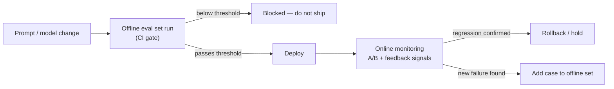

# Evaluation — Senior

<!-- level-focus -->
At senior level, focus on this question:

> How do you combine offline (pre-deploy) and online (post-deploy) evaluation into one strategy, decide what blocks a deploy versus what only gets monitored, and use evidence — not guesswork — when the two signals disagree?

Use the smallest realistic scenario that exposes the decision and its failure behavior.

Part of [Evaluation](README.md).

---

## Core Concept 1 — Two Evaluation Moments, Not One

A middle-level pass gets you a validated scoring pipeline — a judge or automated check you trust because you calibrated it. At senior level, the organizing question changes: **when in the deployment lifecycle does each kind of evaluation run, what decision does it feed, and what does each one structurally miss that the other catches?**

| | Offline evaluation | Online evaluation |
|---|---|---|
| When it runs | Before deploy, against a fixed eval set | After deploy, against real production traffic |
| Signal | Rubric/judge scores on a known, curated set | A/B test results, thumbs up/down, edit rate, follow-up-question rate, escalation-to-human rate |
| Catches | Regressions on known input types, before any real user sees them | Real-world distribution shift, actual user satisfaction, input types the eval set never anticipated |
| Cannot catch | Anything outside the eval set's coverage — a new input pattern the set never included | Anything below its statistical noise floor, or before enough traffic/time has accumulated to be meaningful |
| Feeds | A go/no-go deploy gate | A rollback decision, a monitoring alert, or feedback into the next eval set revision |

Neither one is sufficient alone. Offline evaluation is cheap, fast, and repeatable, but it can only be as good as its eval set's coverage of the real world — a curated set of 200 examples, however carefully built, is a sample, not the distribution. Online evaluation measures the real distribution directly, but only after users have already been exposed to whatever regression might exist, and only once enough volume has accumulated to separate a real effect from noise.

## Core Concept 2 — What a Deploy Gate Must Guarantee

A deploy gate is a promise, not a vague aspiration — name what it actually guarantees:

| Gate guarantee | Mechanism |
|---|---|
| A change never ships if it regresses a tracked offline metric below its threshold | CI step runs the offline eval set on every candidate change; build fails (or blocks merge) if the aggregate score, or any individual tracked-dimension score, drops below the stated bar |
| A change never ships if it regresses a safety- or faithfulness-critical dimension, even if the overall average looks fine | Safety/faithfulness scored and gated as an independent hard floor, not folded into one blended average (the same principle as the junior-level point about not averaging away a safety failure — the stakes are just higher here) |
| The eval set used to gate this change is known and reproducible | Eval set is versioned; the gate result records which eval-set version and which judge/rubric version produced it |

What a gate does *not* guarantee: that the change is good for real users, that no edge case slipped through, or that the offline eval set's coverage matches production's actual input distribution. A gate answers "did this regress what we already know to check" — a narrower claim than "this change is safe to ship," which is exactly why online evaluation exists as a second, independent check.

## Core Concept 3 — What Gets Monitored Instead of Gated, and Why

Two categories of signal are deliberately *not* gates, and for different reasons:

- **Too slow or expensive to measure pre-deploy.** A full human-rated helpfulness study, or a metric that only converges with weeks of real usage (does this change reduce actual support-ticket volume?), cannot run in a CI pipeline on every candidate change without making every deploy take weeks. These get sampled and tracked as ongoing monitoring instead.
- **Only observable at real traffic volume or diversity.** A rare edge-case input class — say, 1 in 4,000 requests that mixes two languages in one query — may appear zero times in a 300-example offline eval set no matter how carefully it's built, and only becomes visible once production traffic naturally generates enough of it to matter. No offline set built with pre-deploy effort in mind can be exhaustive against production's actual long tail.

Concretely, this is where user feedback signals live: thumbs up/down rate, edit rate (how often a user rewrites or corrects the answer instead of accepting it), follow-up-question rate (a proxy for "the first answer didn't fully resolve the need"), and escalation-to-human rate. None of these gate a deploy directly — they're too noisy on small samples and too slow to compute before shipping — but they're exactly the signals that catch what the offline set structurally can't.

## Core Concept 4 — Where Each Evaluation Type Sits in the Lifecycle

The takeaway: offline evaluation feeds a binary go/no-go decision *before* any real user is exposed; online evaluation feeds a rollback or investigation decision *after* exposure, and — critically — a third path back into the offline set itself, closing the loop so a failure online only has to be caught live once.

## Core Concept 5 — Cross-Component Scenario: Offline Passes, Online Thumbs-Down Rises

A prompt change passes the offline eval set cleanly — every tracked dimension at or above threshold, no regression on the safety/faithfulness floor. It ships. Within a few days, the thumbs-down rate on production traffic rises noticeably compared to the previous week. Two hypotheses, and the evidence that actually distinguishes them rather than guessing:

| Hypothesis | Evidence that confirms it | Evidence that rules it out |
|---|---|---|
| **The offline eval set doesn't cover the input distribution that regressed** | New thumbs-down examples, when reviewed, cluster around an input pattern absent or underrepresented in the offline set (a specific query type, a language, a product category); adding a sample of these to the offline set and rerunning the old prompt version against them shows the old prompt also struggled, just never actually measured | New thumbs-down examples are spread evenly across input types already well-represented in the offline set, with no discernible pattern |
| **The online signal is noise, not a real regression** | The absolute number of thumbs-down events is small enough that the swing is within normal week-to-week variance for this metric (check the metric's baseline variance over the prior several weeks, not just this week's raw number); the sample size of feedback events is below what's needed to detect a change of this magnitude at the traffic volume received | The rate change is large relative to the metric's known baseline variance, and traffic volume is high enough that the sample size supports statistical significance at a reasonable confidence level |

Working through it in order: first check sample size — how many thumbs-down events is "rose noticeably" actually built on, and is that above the noise floor for this metric at this traffic volume? If the answer is a handful of events on a low-traffic feature, the honest conclusion is "not yet distinguishable from noise, keep watching" rather than a rollback. If the sample size is adequate, check whether the affected traffic clusters into an identifiable cohort — a specific query type, locale, or user segment — because a uniform regression across all cohorts looks different from one concentrated in a corner the offline set never sampled. If a cohort is identified, pull a sample of its failing examples, verify they'd have failed under the old prompt too (proving the offline set's blind spot, not the new prompt's actual regression), and add them into the offline eval set so this specific gap is closed going forward, whichever prompt version is kept.

## Core Concept 6 — Questions That Expose Weak Assumptions

- "How many thumbs-down (or other feedback) events is this 'regression' actually built on, and what's this metric's normal week-to-week swing at this traffic volume?" Surfaces whether the alarm is statistically real or noise dressed as a trend.
- "If I pulled 20 of the new failing examples, do they share an identifiable trait the offline eval set doesn't sample — a query type, a language, an edge case?" Distinguishes a coverage gap from a genuine regression.
- "Would the *previous* prompt version have also failed on these specific examples?" If yes, the offline set had a blind spot all along, and this incident is exposing it, not something the new prompt uniquely broke.
- "Does the deploy gate's threshold reflect a real quality bar, or is it just wherever the metric happened to land on the version we shipped last?" A threshold set reactively, without a stated target, drifts down every time a marginal change ships.
- "When was the offline eval set last refreshed with real production examples, versus running the same set that's been in place for months?" An eval set that never grows accumulates blind spots exactly like the one this scenario surfaced.

## Core Concept 7 — Recovery and Evolution

Specific triggers should force a re-evaluation of the offline/online split itself, not just of one incident: a deploy-gate threshold that's been passed by every change for months (it may no longer be discriminating anything — check whether it would still catch a deliberately regressed test case), an online metric that moves and nobody can trace back to a specific offline dimension (a sign the offline set and the production reality have drifted apart), or a rollback that the offline gate should have caught but didn't (the concrete trigger to add the failing examples back into the offline set, closing the loop shown in Core Concept 4's diagram).

---

## Real-World Examples

- **A gate threshold that stopped discriminating.** A team's offline faithfulness threshold was set based on the first version of their RAG bot; eighteen months and dozens of shipped changes later, every single change still passes comfortably, which turns out to mean the threshold is no longer close to what any real change would fail — a deliberately regressed test case is used to confirm the gate still blocks *something*, and the threshold is tightened based on the result.
- **A cohort-specific regression the offline set never sampled.** A prompt change ships cleanly through an offline set built mostly from English-language examples; the thumbs-down rate rises specifically among non-English queries, invisible in the aggregate online number until the team splits the metric by detected input language — the offline set is expanded with a sample of non-English examples going forward.
- **Statistical patience prevents an unnecessary rollback.** An online metric dips the day after a low-traffic feature ships; the sample size is a few dozen events, well within the metric's normal weekly swing for that traffic volume — the team holds rather than rolling back, and the metric returns to baseline within a few more days without any change.

## Common Mistakes

- **Treating every online signal as an immediate rollback trigger** without first checking sample size against the metric's normal variance — this produces rollback churn driven by noise, not signal.
- **Never adding failing production examples back into the offline eval set**, so the same gap keeps getting caught live, incident after incident, instead of being closed once.
- **Blending a safety or faithfulness dimension into one averaged score** rather than gating it as an independent floor, letting a serious regression hide inside an acceptable-looking average.
- **Setting a gate threshold once and never revisiting it**, letting it become a rubber stamp that every change passes regardless of whether it's actually a meaningful bar anymore.
- **Assuming an online regression must mean the new change is bad**, without checking whether the previous version would have failed the same newly-discovered examples too.

## Apply it

1. For a system you have (or can reasonably design for), write the specific deploy-gate guarantee in one sentence: which metric, what threshold, and whether it's a hard floor or part of a blended score.
2. Name two signals for that same system that are deliberately monitored, not gated, and state which of the two reasons from Core Concept 3 applies to each.
3. Draw (or adapt) the lifecycle diagram from Core Concept 4 for your specific system, naming the actual tools or dashboards at each step.
4. Given a hypothetical online regression after a clean offline pass, walk through the evidence-gathering order from Core Concept 5 — sample size check, cohort check, "would the old version have failed too" check — and write down what evidence at each step would change your conclusion.
5. Identify one trigger from Core Concept 7 that would currently go unnoticed in your system (a threshold nobody has revisited, an online metric with no offline counterpart) and write the concrete check that would surface it.

## Verify your work

- You can state your deploy gate's guarantee as one falsifiable sentence — a specific metric, a specific threshold, and whether it's an independent floor or part of an average.
- You can name, for your system, at least one signal that is monitored but not gated, and the specific reason (too slow/expensive, or only visible at real volume) it isn't gated.
- Given a hypothetical online regression, you can describe the sample-size check you'd run before concluding it's real, not just assert "the numbers moved."
- You have a concrete mechanism (not just an intention) for adding a newly discovered failing example back into the offline eval set.
- You can name one thing your current offline/online split would currently miss, and what would have to change to catch it.

## Review questions

- What can offline evaluation catch that online evaluation structurally cannot, and what can online evaluation catch that offline structurally cannot?
- Why should a safety or faithfulness dimension be gated as an independent floor rather than folded into a blended average score?
- Given a clean offline pass followed by a rising online thumbs-down rate, what is the first piece of evidence to check, and why that one first?
- What does it mean for a deploy-gate threshold to "stop discriminating," and what would you check to find out if yours has?
- Why does adding a newly discovered failing example back into the offline eval set matter beyond just fixing the immediate incident?
